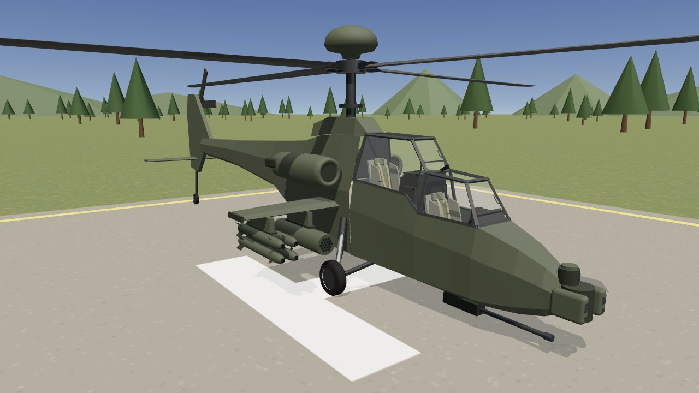

# AH-64 Apache cockpit for VR

`apache_cockpit.glb` is a game-ready model of the AH-64 Apache's tandem cockpit: the copilot/gunner (CPG) sits in front and low, and the pilot sits behind and higher. It's a single glTF 2.0 binary with its textures embedded, built at real-world scale for sitting in with a headset.

| Pilot | Gunner (CPG) |
| --- | --- |
|  |  |
| **Night** | **Outside** |
|  |  |

## What's in it

**Both crew stations**
- **Pilot:** two multipurpose displays (FLT and TSD pages), the up-front display, and master warning and caution. It also has the standby attitude indicator, airspeed indicator, altimeter and clock, plus the armament, jettison and NVS panels, the fire panel on the glareshield, and the keyboard unit.
- **Gunner:** the TEDAC targeting display with its hood and two hand grips (FLIR picture), two MPDs (WPN and ENG pages), the up-front display, the armament panel and the keyboard unit.
- **Side consoles:**
  - Pilot's left: engine power levers and rotor brake in a quadrant, then fuel, engine start, comms, anti-ice.
  - Pilot's right: lighting, data transfer cartridge, tail wheel and park brake, canopy jettison, IFF, intercom.
  - The gunner has its own set.
- **Controls:** cyclic, collective and pedals in both cockpits. The gunner's cyclic stands on the right, clear of the TEDAC.
- **Seats:** armoured crew seats with side armour, cushions, a five-point harness and a rotary buckle.
- **Canopy:** the Apache's flat-plate canopy with its frame, the blast shield between the cockpits, the wire cutter, and a standby compass. Both crew doors are on the right and hinge open.
- **Lighting:** panel lettering has an emissive map, so it glows green at night. Displays and lit buttons are self-lit.

**The outside, as seen from the seats:** the nose with the TADS and PNVS turrets and the 30 mm gun, and the stub wings with a Hellfire launcher and a rocket pod on each. There are also the engine nacelles, the rotor pylon, the Longbow radome and a four-blade main rotor. The tail, stabilator, scissor tail rotor and landing gear are simplified, since they're rarely in view. Hide the `Exterior` node if your game brings its own exterior model.

| | |
| --- | --- |
| Size | 4.9 MB |
| Triangles | 39,329 |
| Draw calls | 171 (24 materials) |
| Textures | 2048² panel atlas and its 2048² emissive map, 1024² display atlas, five 512² screen pages |
| Validation | Khronos glTF Validator: 0 errors, 0 warnings |

## Scale, axes and origin

- **Units and axes:** metres, glTF axes. +Y is up, +Z points toward the nose, and +X is the crew's left, so -X is right. Unity, Unreal, Godot and Blender importers convert the axes for you.
- **Origin:** on the front cockpit floor, on the centreline, under the gunner's seat back.
- **Height above ground:** the aircraft stands on its wheels with the ground at y = −0.95.

## Putting the player in a seat

Two empty nodes mark the design eye points:

| Node | Position (m) |
| --- | --- |
| `Pilot_Eye` | 0, 1.60, −1.36 |
| `CPG_Eye` | 0, 1.13, 0.14 |

For a seated VR experience, put your XR rig's origin at one of these with a device-relative tracking origin. The headset then starts at the crew member's eyes. Their local +Z faces forward.

## Interactive parts

Every part a player might grab is its own node, with its origin on the real pivot. Its axes are aligned so that one rotation drives it. Rotations are right-handed, in radians, about the node's local axes.

| Node | Pivot | How to drive it |
| --- | --- | --- |
| `Pilot_Cyclic`, `CPG_Cyclic` | gimbal at the base | +X rotation pushes the stick forward; +Z rotation pushes it right |
| `Pilot_Collective`, `CPG_Collective` | rear pivot | −X rotation raises it |
| `Pilot_Pedal_Left/Right`, `CPG_Pedal_Left/Right` | hinge at the top of each arm | −X rotation pushes a pedal forward; drive the two in opposition |
| `Pilot_Power_Lever_1/2` | under the quadrant | modelled at FLY; about −47° about X is IDLE, about −84° is OFF |
| `Pilot_Rotor_Brake` | under the quadrant | modelled at OFF; rotate about X |
| `CPG_TEDAC_Grip_Left/Right` | where the arm meets the TEDAC | hand grips; attach grab points here |
| `Canopy_Door_CPG`, `Canopy_Door_Pilot` | hinge along the top rail (local X) | +X rotation swings the door up and out; about 1.15 is fully open |
| `Main_Rotor` | hub | spin about Y; + is counter-clockwise seen from above, as on the real aircraft |
| `Tail_Rotor` | hub | spin about X |
| `Pilot_Standby_ASI_Needle` | gauge centre | rests at 0 kt; rotation about Z = −(knots ÷ 200) × 1.75π |
| `Pilot_Standby_ALT_Needle1` / `_Needle2` | gauge centre | rest at 0 ft; 1,000 ft and 10,000 ft per turn, clockwise is negative Z |
| `Pilot_Standby_ADI_Ball` | gauge centre | roll about Z |
| `TADS_PNVS`, `PNVS`, `M230_Gun` | turret centre | slew about Y |

These notes are also stored in each node's glTF `extras`.

## Screens

The four MPDs and the TEDAC each have a `…_Screen` node with its own material: `Screen_Pilot_MPD_Left`, `Screen_Pilot_MPD_Right`, `Screen_CPG_MPD_Left`, `Screen_CPG_MPD_Right` and `Screen_CPG_TEDAC`. Each screen quad has 0–1 UVs, so you can swap the material's texture for a render texture to show a live FLIR or map view. The shipped pages are static pictures.

The up-front displays, keyboard scratchpads and lit buttons share the `Displays` atlas material. Panel faces, switch legends and gauge faces share the `Panels` atlas material. Its emissive map lights only the lettering, so turn the material's emission up for night flying and down for daylight.

## Preview it

`viewer.html` loads the model with three.js. It lets you switch between the pilot's seat, the gunner's seat and a walkaround, toggle night lighting, spin the rotor and open the doors. Serve the folder over HTTP and open the page:

```sh
cd apache-cockpit
python3 -m http.server 8080
# then open http://localhost:8080/viewer.html
```

The page loads three.js from jsDelivr, so it needs an internet connection. In a WebXR browser such as the Quest browser, an **Enter VR** button puts you in the pilot's or gunner's seat. Browsers allow VR only on HTTPS pages or on localhost, so to try it in a headset, host the folder on an HTTPS server such as GitHub Pages.

## Rebuilding

The model is generated by code, so you change it by editing the source and running the generator again:

```sh
cd apache-cockpit
npm install playwright && npx playwright install chromium   # once
node generate.mjs              # writes apache_cockpit.glb
node generate.mjs --textures   # also writes the painted textures to textures/
```

| File | What it holds |
| --- | --- |
| `lib/cockpit.mjs` | Tub, canopy and the layout of both crew stations: which panel goes where, and each panel's switches and labels |
| `lib/parts.mjs` | Reusable parts: panels and their switches, MPDs, EUFD, keyboard unit, gauges, seat, cyclic, collective, pedals, levers |
| `lib/exterior.mjs` | The outside of the aircraft |
| `lib/paint.js` | Paints the textures (panel lettering, gauges, display pages) in headless Chromium |
| `lib/geo.mjs` | Mesh helpers and the GLB writer |

A panel is a list of controls with their labels, so a new switch is one line. The same list draws the lettering on the texture and places the 3D switch.

## Accuracy

The layout is modelled on the AH-64D/E cockpit from general knowledge of the aircraft, not from manufacturer drawings. Proportions, panel placement and legends are representative, not exact, and some panels are simplified. The display pages are plausible symbology, not real software output.
