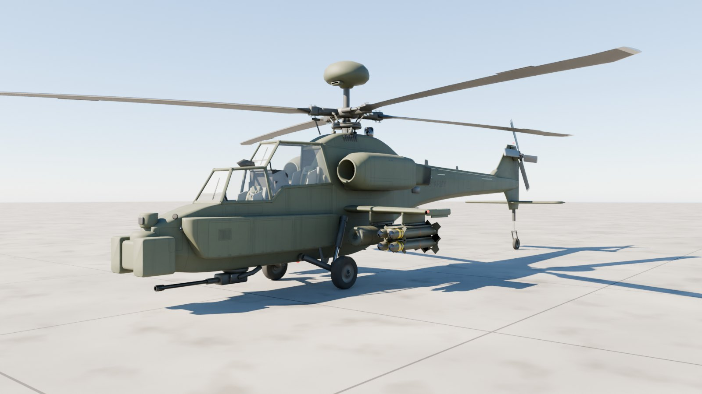
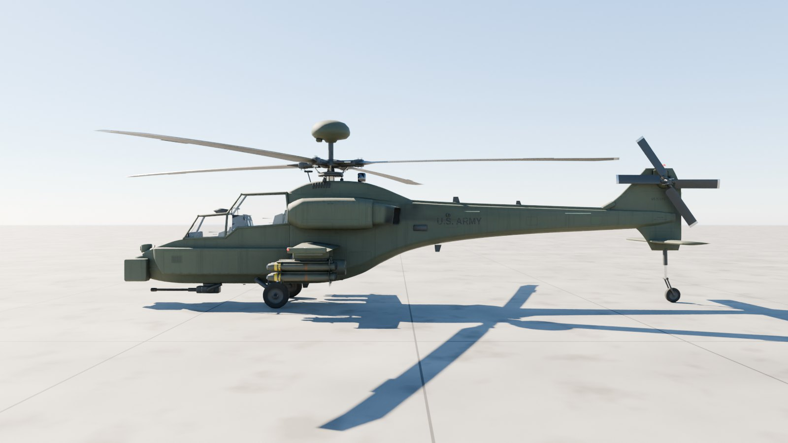
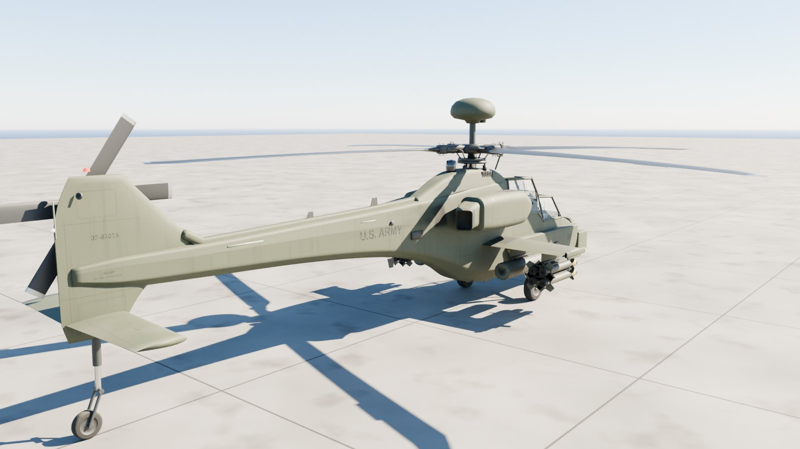
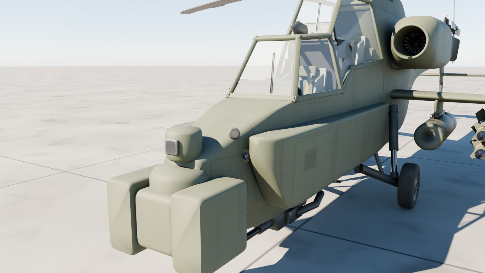
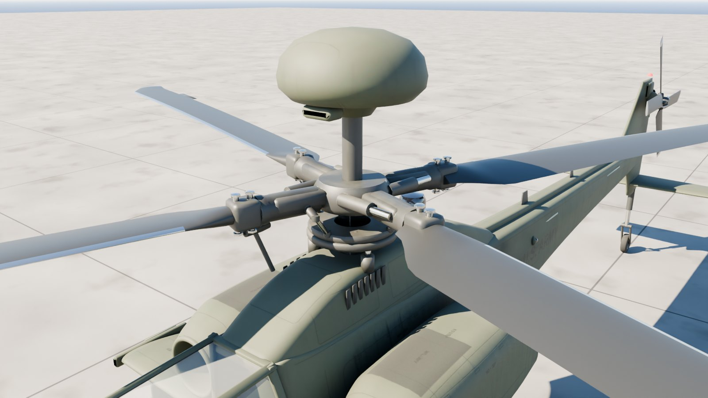
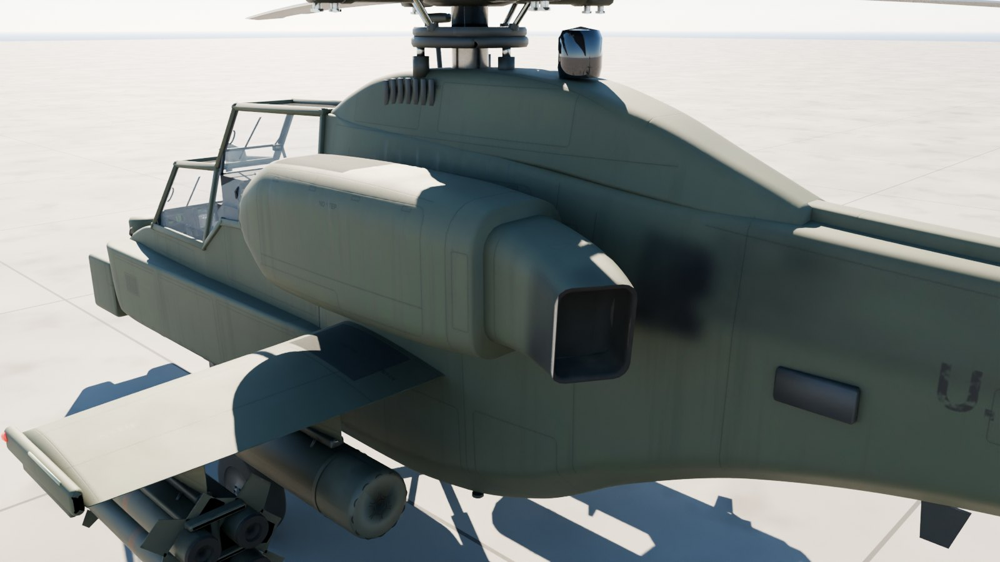
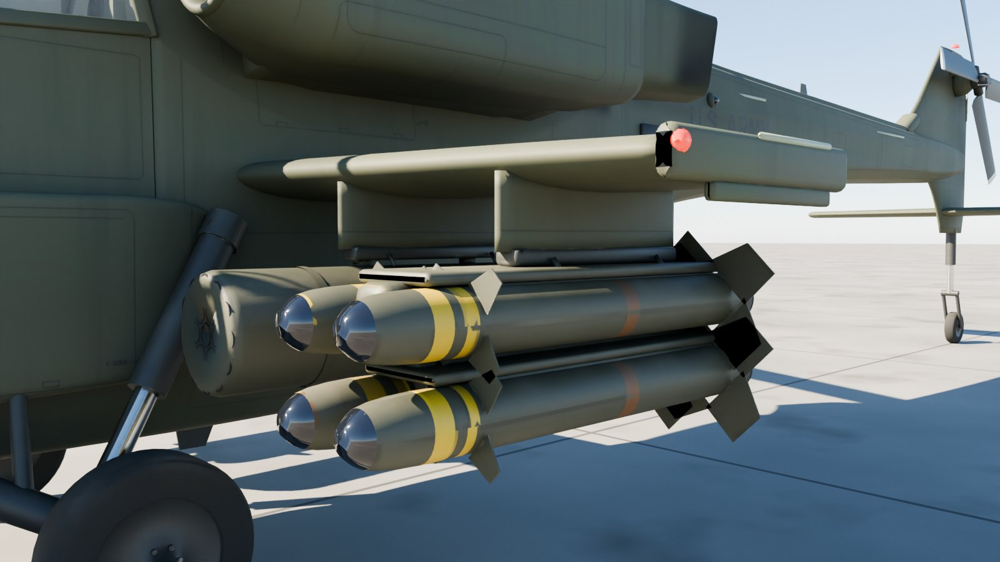
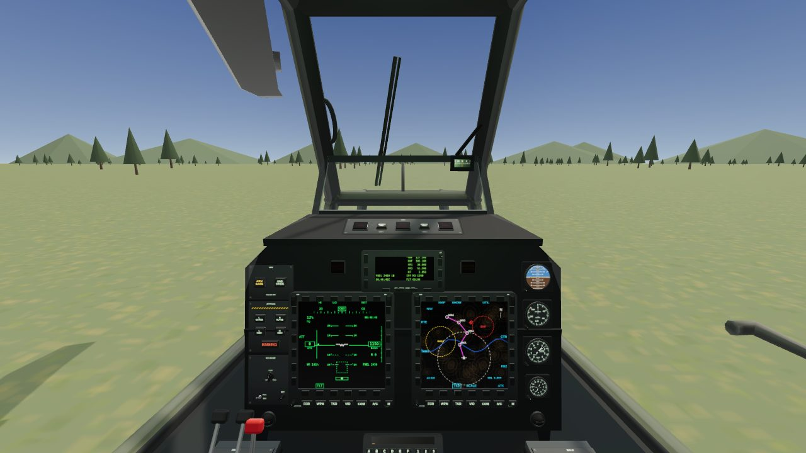
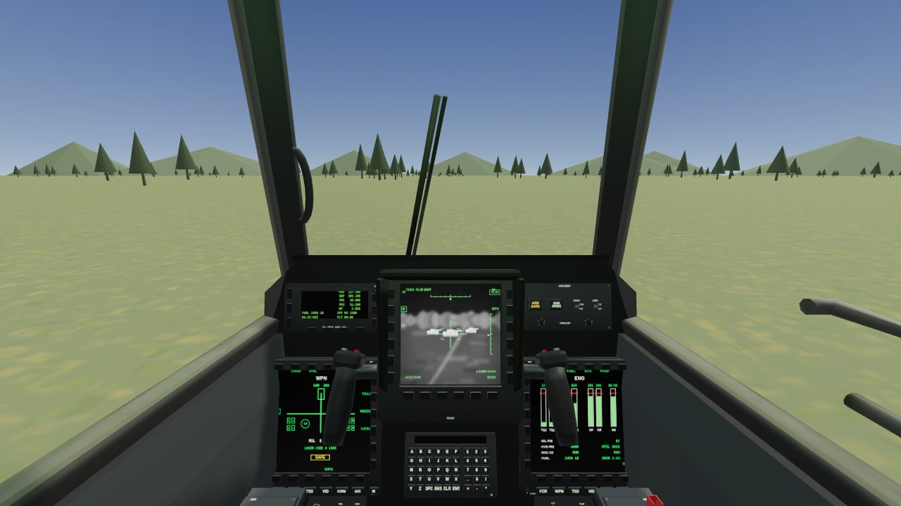

# AH-64D Apache for VR

A game-ready AH-64D Apache Longbow for VR, inside and out, at 1:1 scale.

- **The outside** is modelled in Blender from cross-sections at the published dimensions. It carries fully baked PBR paint: panel lines, rivets, stencils, walkways, exhaust soot, oil streaks, dust, grime and worn edges.
- **The tandem cockpit** is fully operable. Every switch, knob, button, key, lever, stick and door is its own part, pivoted where it really moves.
- **`viewer.html`** puts it all to work: start the engines, fly, work the displays and fire the weapons, on a screen or in a headset.



| Side | Rear |
| --- | --- |
|  |  |
| **Sensors and nose** | **Rotor head and Longbow radar** |
|  |  |
| **Engine and IR suppressor** | **Stub wing and stores** |
|  |  |
| **Pilot's station (the working cockpit)** | **Gunner's station** |
|  |  |

## Files

| File | What it is |
| --- | --- |
| `apache_ah64d.glb` | **The aircraft.** The textured 1:1 outside and the working cockpit, with every control and moving part its own node. TBD |
| `apache_ah64d_static.glb` | The same, with the cockpit's controls merged in, for when nothing inside needs to move. TBD |
| `apache_ah64d_web.glb` | A lighter copy for the browser viewer, with half-size WebP textures. TBD |
| `apache_exterior.glb` | The outside on its own, as Blender exports it. TBD |
| `controls.json` | Every operable control: its node, what it does, how it moves. |
| `measurements.json` | The finished model measured against the published dimensions. |
| `viewer.html`, `viewer/`, `lib/paint.js` | The working aircraft in three.js: the systems, the flight model, live displays, weapons, VR. |
| `exterior/` | The Blender build of the outside: geometry, paint, weathering and baking. |
| `generate.mjs`, `lib/` | The cockpit generator. |
| `merge.mjs` | Joins the cockpit and the outside into `apache_ah64d*.glb`. |

## The outside

- **Built from cross-sections:** stations along the fuselage, each with its chines and corners filleted. The sections are interpolated smoothly between stations and lofted into a clean, dense skin, so it shades like the aircraft does, with no faceting.
- **Separate assemblies:** the Longbow's extended avionics bays, the rotor pylon, and the engine nacelles with their intakes and "Black Hole" IR-suppressing exhausts. Also the stub wings with their pylons and ejector racks, the fin, stabilator and tail rotor gearbox fairing, and the tail rotor drive-shaft cover.
- **Canopy:** the flat-plate canopy has its real frame layout. The frames are painted outside and dark inside, and both crew doors hinge along their top rails.
- **Rotor head and radar:**
  - A fully articulated main rotor head with strap-pack housings, pitch housings, blade grips and retention bolts. It also has lead-lag dampers, pitch horns and links, and both swashplates.
  - Blades with the HH-02-style section, 9° of twist and the 20° swept tips. They have nickel leading-edge strips and trim tabs.
  - The Longbow fire control radar on its mast.
- **Sensors and gun:** the TADS turret with its night and day sensor shrouds and their windows, the PNVS, and the M230 30 mm chain gun with its feed chute.
- **Landing gear:** trailing-arm main gear with oleo struts, and the castering tail wheel.
- **Stores:** M261 19-shot rocket pods and M299 launchers with four AGM-114 Hellfires each.
- **Small parts:** navigation, anti-collision, formation and search lights. CMWS missile-warning sensors, RWR antennas, blade antennas, the air data sensor, the ALQ-144 jammer, chaff dispensers, steps, handholds and tie-downs.

**Paint:** the look is built procedurally in Cycles, then baked into standard PBR textures:

| Texture set | Size | Covers |
| --- | --- | --- |
| `AH64_Paint_Fwd` | 4096² | Nose, cockpit section, avionics bays, canopy frames, sensors, engines, pylon, radome |
| `AH64_Paint_Aft` | 4096² | Aft fuselage and tail boom, fin, stabilator, wings and pylons |
| `AH64_Mech` | 2048² | Rotor head, gear, gun, wheels, antennas, exhaust insides |
| `AH64_Stores` | 2048² | Rocket pods, launchers, Hellfires |

Each set has a base colour, an occlusion-roughness-metallic map and a normal map. The skin comes out at about 2.5 mm per texel.

The paint is Army aircraft green, faded unevenly panel by panel. Its layers:
- panel lines with grime settled in them;
- rivet rows and a faint orange peel in the normal map;
- stencils: U.S. ARMY, the serial, DANGER, NO STEP, RESCUE, JP-8, GROUND HERE;
- non-skid walkways;
- exhaust soot trailing down the boom, and oil weeping from the transmission deck and tail gearbox;
- dust low down and on top, rain streaks, and worn edges.

Canopy glass, sensor windows, rotor blades and light lenses use plain material values.

**Moving parts:** each is its own node, pivoted where it turns, with its axis in the node's glTF extras:

| Node | Moves |
| --- | --- |
| `Main_Rotor` | spins about local Y (289 rpm at 100%) |
| `Tail_Rotor` | spins about local X (1,403 rpm) |
| `TADS_Turret` / `TADS_Sensors` | slew about Y / elevate about X |
| `PNVS_Turret` | slews about Y, following the pilot's head |
| `M230_Turret` / `M230_Gun` | trains about Y / elevates about X |
| `Canopy_Door_CPG`, `Canopy_Door_Pilot` | open about their hinge (these are operable controls) |
| `Store_{Left,Right}_{Inboard,Outboard}`, `Hellfire_*` | can be fired or jettisoned |
| `Light_*` | lenses with emissive materials `Light_Nav_Red/Green/White`, `Light_Anticollision` |

## Scale: 1:1 with the real aircraft

The outside is built to published AH-64D figures. `exterior/build.py` measures the finished geometry against them on every build and writes `measurements.json`:

TBD

- **Units and axes:** metres, glTF axes. +Y is up, +Z points toward the nose, and +X is the crew's left.
- **Origin:** on the front cockpit floor, under the gunner's seat back. The cockpit and the outside share it.
- **Ground:** the wheels stand on y = −0.95, marked by the `Ground_Reference` node.

## Putting the player in a seat

`Pilot_Eye` (0, 1.60, −1.36) and `CPG_Eye` (0, 1.13, 0.14) mark the design eye points. For seated VR, put your XR rig's origin there with a device-relative tracking origin; the node's +Z faces forward.

## Operable controls

There are 399:

| Kind | Count |
| --- | --- |
| Keys (display bezels, keyboard units, up-front displays) | 252 |
| Rotary knobs | 48 |
| Push buttons (34), rockers (8) and guards (1) | 43 |
| Toggle switches | 33 |
| Levers | 5 |
| Pull handles | 4 |
| Triggers | 4 |
| Pedals | 4 |
| Sticks | 2 |
| Collectives | 2 |
| Canopy doors | 2 |

Each one's glTF extras (Blender shows them as custom properties) say how it moves:

```jsonc
// Pilot_FUEL_BOOST
{ "control": "toggle", "label": "FUEL · BOOST", "fn": "boost",
  "motion": "rotate", "axis": [1, 0, 0],
  "positions": ["ON", "OFF"], "angles": [-0.454, 0.454], "state": 1,
  "rest": { "rotation": [x, y, z, w], "translation": [x, y, z] } }
```

To put a control in a position:

- **Rotating controls** (toggles, knobs, levers, doors, rockers): set its local rotation to `rest.rotation × AxisAngle(axis, angles[i])`.
- **Continuous controls:** use `min + (max − min) × value` as the angle.
- **Buttons, keys and handles:** they move along `axis` by `travel`. Set the local position to `rest.translation + rotate(rest.rotation, axis) × travel`.
- **Sticks:** `motion: "stick"` tilts about `axes.pitch` (+ forward) and `axes.roll` (+ right), up to `limits`.

Other fields:

- `momentary` and `spring` mark positions that spring back, such as ENG START.
- `latching` marks buttons that stay on.
- `lit` is a lit legend's state. Swap its material between `Displays` (lit) and `Displays_Unlit`.

`fn` is the control's function: `pwr1`, `rtrBrk`, `apu`, `masterArm`, `trigger`, `collective`, `mpd:Pilot_MPD_Left:FCR`, `ku:Pilot_KU:A` and so on. Controls that share an `fn` are linked, such as the two cyclics, collectives and pedal pairs. `controls.json` lists every control with the same fields. `viewer/controls.js` and `viewer/sim.js` are a complete working example of driving them.

## Live displays

Each of the 11 displays has its own `Screen_*` material with 0–1 UVs: the four MPDs, the TEDAC, both up-front displays, both keyboard scratchpads, the standby attitude ball and the compass card. Swap in a render texture, or repaint them with `lib/paint.js`. It draws every page from live data:

- MPD pages: FLT, TSD, WPN, ENG, FUEL, FCR, VID, COM, A/C and MENU.
- The TEDAC's FLIR and TV pictures.
- The up-front display, scratchpads, attitude ball and compass.

## What works in the viewer

- **Engines and rotor:**
  - APU start.
  - Engine start with the spring-loaded ENG START switches.
  - Power levers OFF, IDLE and FLY.
  - Rotor RPM, the rotor brake, and fire handles that shut an engine down.
  - Live engine instruments.
- **Warnings:** cautions and warnings listed on the up-front display, plus MASTER WARNING and MASTER CAUTION lamps that you acknowledge by pressing them.
- **Flying:** the cyclic, collective and pedals fly the aircraft (the two cockpits' controls are linked). The FLT page, the standby airspeed, altimeter, attitude and clock, the compass and the moving map all follow.
- **Displays:**
  - The fixed-action keys and MENU change pages; the bezel keys pick options.
  - BRT and VID rockers set brightness and contrast; DAY/NT/MONO sets the colour mode.
  - The keyboard units type into their scratchpads.
  - The up-front display's RTS and SWAP keys work the radios.
- **Sight:**
  - TADS power, FLIR and TV, polarity, gain and level.
  - Field of view and laser ranging from the grips.
  - Slewing the sight, with the turret and gun following it.
- **Weapons:**
  - Master arm and ground override.
  - Weapon select from the cyclic or the WPN page.
  - Gun bursts set by the BURST knob, rocket pairs, and Hellfires launched off the rails.
  - Each station jettisons.
- **Lights and canopy:**
  - Interior lighting and floodlights.
  - Navigation lights and anti-collision strobes, and a searchlight.
  - Opening doors, and canopy jettison.
- **Sound:** synthesised rotor, turbines and APU, switch clicks and the warning tone.

## Preview it

The quickest way is `apache_ah64d_viewer.html` (built by `node standalone.mjs`, below). It holds the model, three.js and the viewer in one file, so double-clicking it opens the working aircraft, even offline.

To work on the viewer itself, serve the folder over HTTP and open `viewer.html`:

```sh
cd apache-cockpit
python3 -m http.server 8080
# then open http://localhost:8080/viewer.html
```

On a screen:

- Click a control to operate it; right-click moves it back.
- Drag sticks and levers, and scroll over a knob to turn it.
- Drag empty space to look around, or pick **Walkaround** to orbit the outside.
- `R`/`F` move the collective, `W A S D` the cyclic and `Q`/`E` the pedals.
- `Space` fires, `G` changes weapon and `I J K L` slew the sight.
- **How to fly** walks through a shutdown and start-up.

In a WebXR browser such as the Quest browser, **Enter VR** seats you in the cockpit:

- Point at a control and pull the trigger to operate it.
- Grab sticks and levers with the grip button.
- The right thumbstick flies the cyclic, the left the collective and pedals.

Browsers allow VR only on HTTPS pages or on localhost, so host the folder on HTTPS (GitHub Pages works) to use a headset. The page loads three.js from jsDelivr.

## Performance

TBD

For standalone headsets:

- Use `apache_ah64d_static.glb`, or batch the cockpit's controls (for example, three.js BatchedMesh or your engine's dynamic batching).
- Downscale the 4K skin textures to 2K. `apache_ah64d_web.glb` already does this, and it looks almost the same beyond arm's length.

The viewer switches its shadows off in VR, and only the displays in view need repainting.

## Rebuilding

```sh
cd apache-cockpit
npm install                                  # once: Playwright, glTF-Transform, sharp, esbuild, three
pip install bpy==5.0.1 pillow                # once, with Python 3.11: Blender as a module

node generate.mjs                            # the cockpit: apache_cockpit*.glb and controls.json
python3.11 exterior/build.py --glb apache_exterior.glb --textures 4096 --blend apache_exterior.blend
                                             # the outside: geometry, paint, 4K bake (about an hour and a half on 4 cores)
node merge.mjs                               # apache_ah64d.glb, _static and _web
node standalone.mjs                          # apache_ah64d_viewer.html: the viewer in one file
python3.11 exterior/render.py apache_ah64d.glb docs   # the beauty renders
```

`exterior/build.py --preview DIR --lookdev` renders the procedural paint without baking, for tuning.

| File | What it holds |
| --- | --- |
| `exterior/ah64.py` | The published dimensions (`SPEC`) and where they put things. |
| `exterior/airframe.py` | The fuselage sections, avionics bays, pylon, nacelles and exhausts, wings, tail and canopy. |
| `exterior/systems.py` | Rotors, radar, sensors, gun, gear, stores, lights, antennas and fittings. |
| `exterior/decals.py` | The paint maps: panel lines, rivets, stencils, walkways, soot and stains, drawn from four sides. |
| `exterior/paint.py` | The weathered paint shaders, UV unwrapping and baking. |
| `exterior/geom.py` | Lofts, fillets, airfoils, lathes and the other mesh helpers. |
| `lib/cockpit.mjs` | The tub and both crew stations. Each panel is a list of its controls with labels and functions, so a new switch is one line. |
| `lib/parts.mjs` | Operable parts: toggles, knobs, buttons, keys, rockers, guards, levers, sticks, pedals, displays, gauges, seats. |
| `lib/paint.js` | Panel lettering, gauges and every display page, from live data. |
| `lib/geo.mjs` | Mesh helpers and the GLB writer. |

## Accuracy

Everything is modelled on the AH-64D Longbow from general knowledge of the aircraft, not from manufacturer drawings.

- **Dimensions:** the overall dimensions match published figures exactly. The shapes between them, such as cross-sections, nacelle and exhaust shapes and the sensor turrets, are close but estimated from the aircraft's familiar lines.
- **Cockpit:** panel placement and legends are representative, and some panels are simplified.
- **Markings:** plausible US Army stencils; the serial number is made up.
- **Systems and flight model:** made to feel right in a game, not to train pilots.
- **Display pages:** plausible symbology, not real software output.
