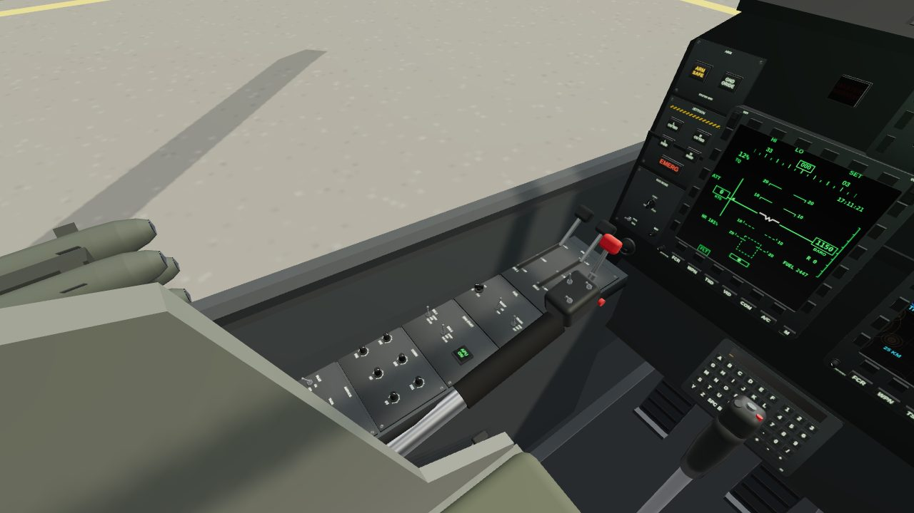
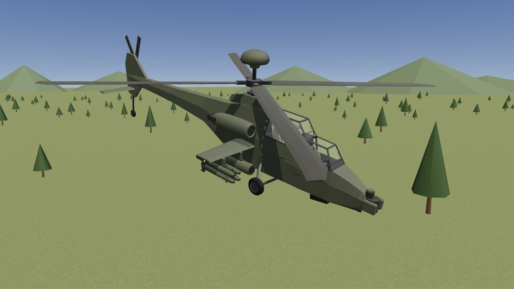
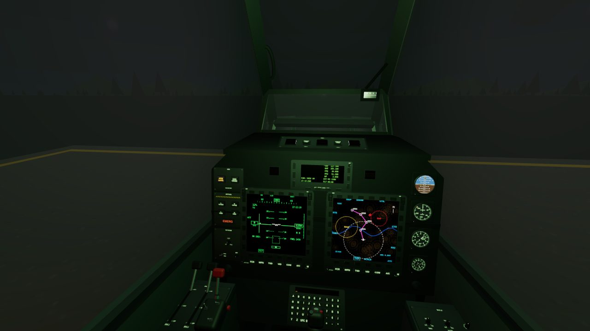

# AH-64 Apache cockpit for VR

A game-ready AH-64 Apache for VR. The tandem cockpit is fully operable: every switch, knob, button, key, lever, stick and door is its own part, pivoted where it really moves. The whole aircraft is built at 1:1 scale to the published dimensions. `viewer.html` puts it all to work: start the engines, fly, work the displays and fire the weapons, on a screen or in a headset.

| Pilot | Gunner (CPG) |
| --- | --- |
|  |  |
| **Working switches** | **Flying** |
|  |  |

## Files

| File | What it is |
| --- | --- |
| `apache_cockpit.glb` | The aircraft, with 399 operable controls, each its own node with its motion in glTF extras. 5.0 MB, 41,229 triangles, 581 draw calls. |
| `apache_cockpit_static.glb` | The same model with the controls merged in, for when nothing needs to move. 4.6 MB, 173 draw calls. |
| `controls.json` | Every operable control: its node, what it does, how it moves. |
| `viewer.html`, `viewer/`, `lib/paint.js` | The working cockpit in three.js: the systems, the flight model, live displays, weapons, VR. |
| `generate.mjs`, `lib/` | The generator that builds all of the above. |

Both models pass the Khronos glTF Validator with no errors or warnings. Textures are embedded:
- panel lettering, a 2048² atlas with an emissive map for night lighting;
- lit legends, a 1024² atlas;
- 11 live screens with 0–1 UVs.

## Scale: 1:1 with the real aircraft

The model is built to published AH-64D figures. The generator measures the finished geometry against them every time it runs:

| Dimension | Published | Model |
| --- | --- | --- |
| Fuselage length | 14.97 m | 14.970 m |
| Length, rotors turning | 17.73 m | 17.742 m |
| Main rotor diameter | 14.63 m | 14.642 m |
| Tail rotor diameter | 2.79 m | 2.801 m |
| Wingspan | 5.227 m | 5.227 m |
| Wheel track | 2.03 m | 2.030 m |
| Wheelbase | 10.59 m | 10.590 m |
| Height to top of rotor head | 3.87 m | 3.870 m |
| Height to top of Longbow radome | 4.95 m | 4.950 m |

The rotor figures come out about a centimetre long because of the blade tips' sweep.

- **Units and axes:** metres, glTF axes. +Y is up, +Z points toward the nose, and +X is the crew's left.
- **Origin:** on the front cockpit floor, under the gunner's seat back.
- **Ground:** the wheels stand on y = −0.95, marked by the `Ground_Reference` node.

## Putting the player in a seat

`Pilot_Eye` (0, 1.60, −1.36) and `CPG_Eye` (0, 1.13, 0.14) mark the design eye points. For seated VR, put your XR rig's origin there with a device-relative tracking origin; the node's +Z faces forward.

## Operable controls

There are 399:

| Kind | Count |
| --- | --- |
| Keys (display bezels, keyboard units, up-front displays) | 252 |
| Rotary knobs | 48 |
| Push buttons (34), rockers (8) and guards (1) | 43 |
| Toggle switches | 33 |
| Levers | 5 |
| Pull handles | 4 |
| Triggers | 4 |
| Pedals | 4 |
| Sticks | 2 |
| Collectives | 2 |
| Canopy doors | 2 |

Each one's glTF extras (Blender shows them as custom properties) say how it moves:

```jsonc
// Pilot_FUEL_BOOST
{ "control": "toggle", "label": "FUEL · BOOST", "fn": "boost",
  "motion": "rotate", "axis": [1, 0, 0],
  "positions": ["ON", "OFF"], "angles": [-0.454, 0.454], "state": 1,
  "rest": { "rotation": [x, y, z, w], "translation": [x, y, z] } }
```

To put a control in a position:

- **Rotating controls** (toggles, knobs, levers, doors, rockers): set its local rotation to `rest.rotation × AxisAngle(axis, angles[i])`.
- **Continuous controls:** use `min + (max − min) × value` as the angle.
- **Buttons, keys and handles:** they move along `axis` by `travel`. Set the local position to `rest.translation + rotate(rest.rotation, axis) × travel`.
- **Sticks:** `motion: "stick"` tilts about `axes.pitch` (+ forward) and `axes.roll` (+ right), up to `limits`.

Other fields:

- `momentary` and `spring` mark positions that spring back, such as ENG START.
- `latching` marks buttons that stay on.
- `lit` is a lit legend's state. Swap its material between `Displays` (lit) and `Displays_Unlit`.

`fn` is the control's function: `pwr1`, `rtrBrk`, `apu`, `masterArm`, `trigger`, `collective`, `mpd:Pilot_MPD_Left:FCR`, `ku:Pilot_KU:A` and so on. Controls that share an `fn` are linked, such as the two cyclics, collectives and pedal pairs. `controls.json` lists every control with the same fields. `viewer/controls.js` and `viewer/sim.js` are a complete working example of driving them.

Other moving parts are driven nodes: the main and tail rotors, the TADS and PNVS turrets, the M230 gun, and the standby gauge needles. Their extras say which axis to turn them about. The rocket pods and Hellfire launchers are `Store_*` nodes and each missile is its own `Hellfire_*` node, so they can be fired or jettisoned.

## Live displays

Each of the 11 displays has its own `Screen_*` material with 0–1 UVs: the four MPDs, the TEDAC, both up-front displays, both keyboard scratchpads, the standby attitude ball and the compass card. Swap in a render texture, or repaint them with `lib/paint.js`. It draws every page from live data:

- MPD pages: FLT, TSD, WPN, ENG, FUEL, FCR, VID, COM, A/C and MENU.
- The TEDAC's FLIR and TV pictures.
- The up-front display, scratchpads, attitude ball and compass.



## What works in the viewer

- **Engines and rotor:**
  - APU start.
  - Engine start with the spring-loaded ENG START switches.
  - Power levers OFF, IDLE and FLY.
  - Rotor RPM, the rotor brake, and fire handles that shut an engine down.
  - Live engine instruments.
- **Warnings:** cautions and warnings listed on the up-front display, plus MASTER WARNING and MASTER CAUTION lamps that you acknowledge by pressing them.
- **Flying:** the cyclic, collective and pedals fly the aircraft (the two cockpits' controls are linked). The FLT page, the standby airspeed, altimeter, attitude and clock, the compass and the moving map all follow.
- **Displays:**
  - The fixed-action keys and MENU change pages; the bezel keys pick options.
  - BRT and VID rockers set brightness and contrast; DAY/NT/MONO sets the colour mode.
  - The keyboard units type into their scratchpads.
  - The up-front display's RTS and SWAP keys work the radios.
- **Sight:**
  - TADS power, FLIR and TV, polarity, gain and level.
  - Field of view and laser ranging from the grips.
  - Slewing the sight, with the turret and gun following it.
- **Weapons:**
  - Master arm and ground override.
  - Weapon select from the cyclic or the WPN page.
  - Gun bursts set by the BURST knob, rocket pairs, and Hellfires launched off the rails.
  - Each station jettisons.
- **Lights and canopy:**
  - Interior lighting and floodlights.
  - Navigation lights and anti-collision strobes, and a searchlight.
  - Opening doors, and canopy jettison.
- **Sound:** synthesised rotor, turbines and APU, switch clicks and the warning tone.

## Preview it

Serve the folder over HTTP and open `viewer.html`:

```sh
cd apache-cockpit
python3 -m http.server 8080
# then open http://localhost:8080/viewer.html
```

On a screen:

- Click a control to operate it; right-click moves it back.
- Drag sticks and levers, and scroll over a knob to turn it.
- Drag empty space to look around.
- `R`/`F` move the collective, `W A S D` the cyclic and `Q`/`E` the pedals.
- `Space` fires, `G` changes weapon and `I J K L` slew the sight.
- **How to fly** walks through a shutdown and start-up.

In a WebXR browser such as the Quest browser, **Enter VR** seats you in the cockpit:

- Point at a control and pull the trigger to operate it.
- Grab sticks and levers with the grip button.
- The right thumbstick flies the cyclic, the left the collective and pedals.

Browsers allow VR only on HTTPS pages or on localhost, so host the folder on HTTPS (GitHub Pages works) to use a headset. The page loads three.js from jsDelivr.

## Performance

In `apache_cockpit.glb` every control is a separate draw call, 581 in all, which is comfortable on PC VR.

For standalone headsets:

- Batch the controls (for example, three.js BatchedMesh or your engine's dynamic batching).
- Or use `apache_cockpit_static.glb` (173 draw calls) and bring in just the controls you want to move.

The viewer switches its shadows off in VR, and only the displays in view need repainting.

## Rebuilding

```sh
cd apache-cockpit
npm install playwright && npx playwright install chromium   # once
node generate.mjs              # both .glb files, controls.json, and the 1:1 check
node generate.mjs --textures   # also writes the painted textures to textures/
```

| File | What it holds |
| --- | --- |
| `lib/cockpit.mjs` | The tub, canopy and both crew stations. Each panel is a list of its controls with labels and functions, so a new switch is one line. |
| `lib/parts.mjs` | Operable parts: toggles, knobs, buttons, keys, rockers, guards, levers, sticks, pedals, displays, gauges, seats. |
| `lib/exterior.mjs` | The aircraft's outside, built from the published dimensions (`SPEC`). |
| `lib/paint.js` | Panel lettering, gauges and every display page, from live data. |
| `lib/geo.mjs` | Mesh helpers and the GLB writer. |

## Accuracy

The layout is modelled on the AH-64D/E from general knowledge of the aircraft, not from manufacturer drawings. The main dimensions match published figures. Panel placement and legends are representative, and some panels are simplified. The systems and flight model are made to feel right in a game, not to train pilots. The display pages are plausible symbology, not real software output.
