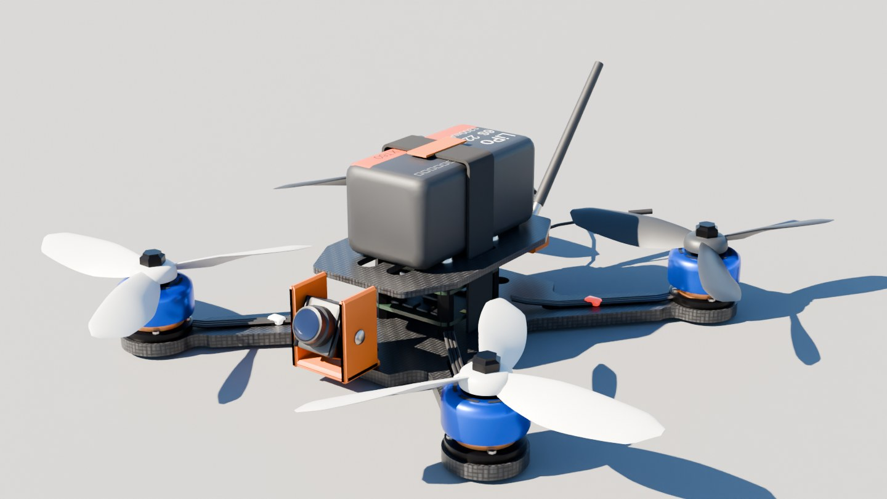
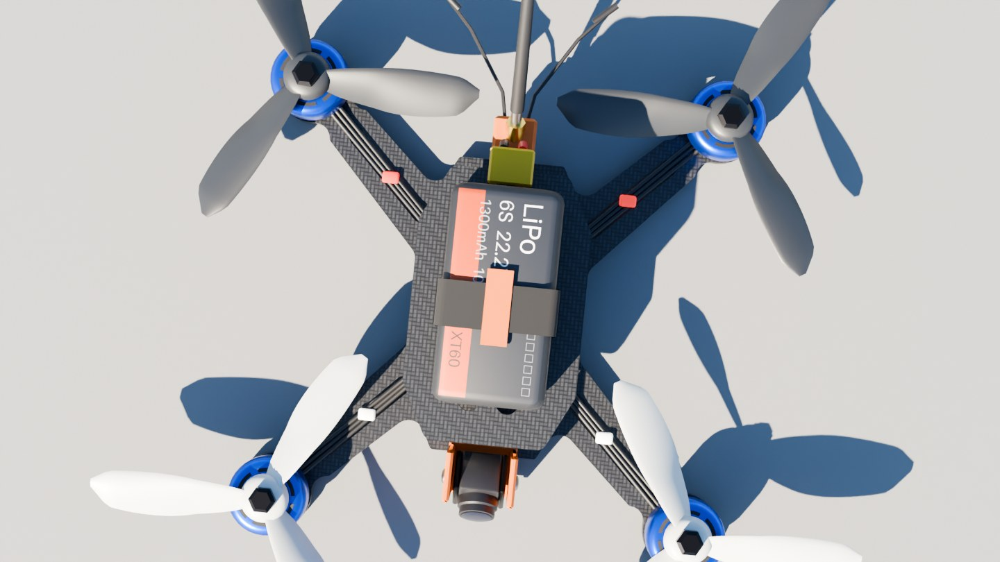
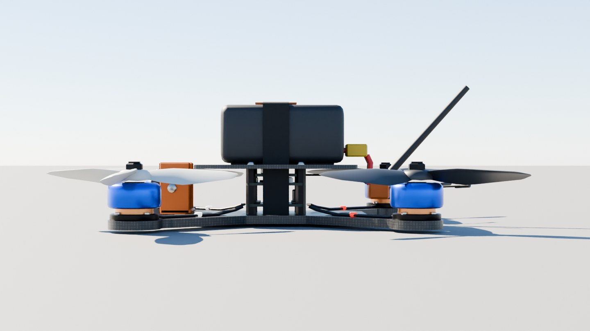
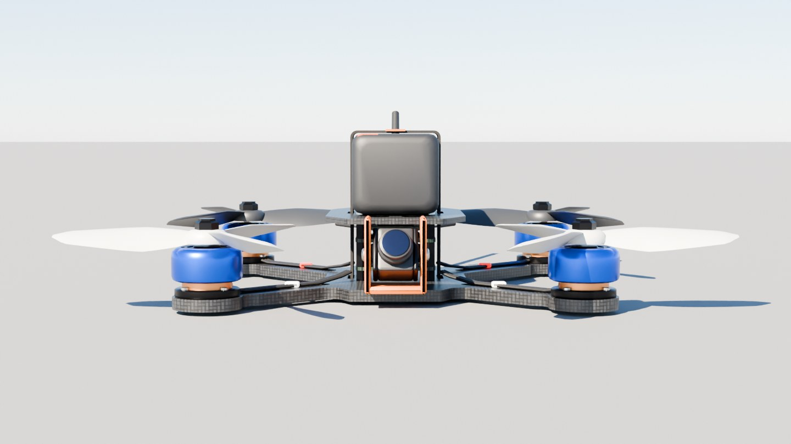
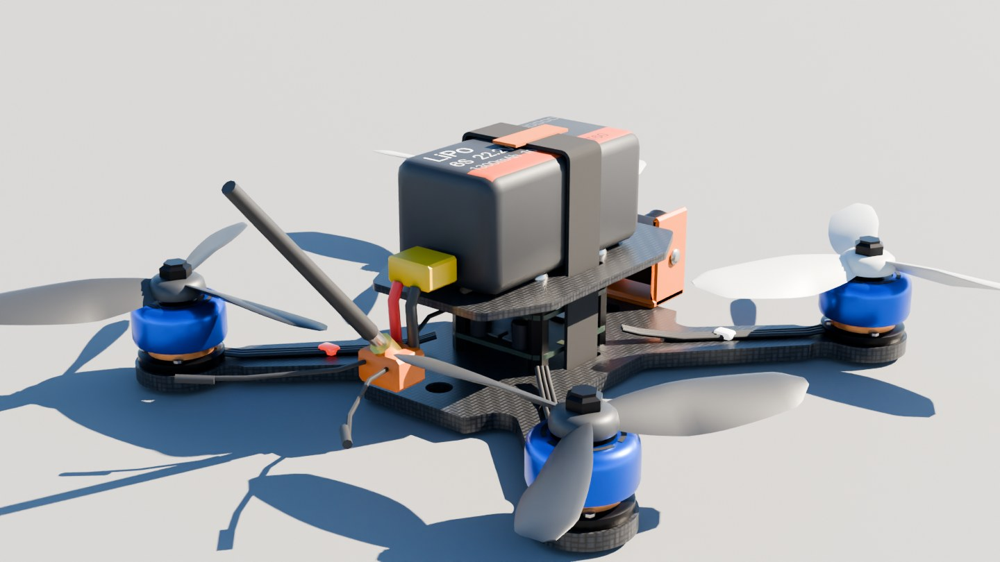
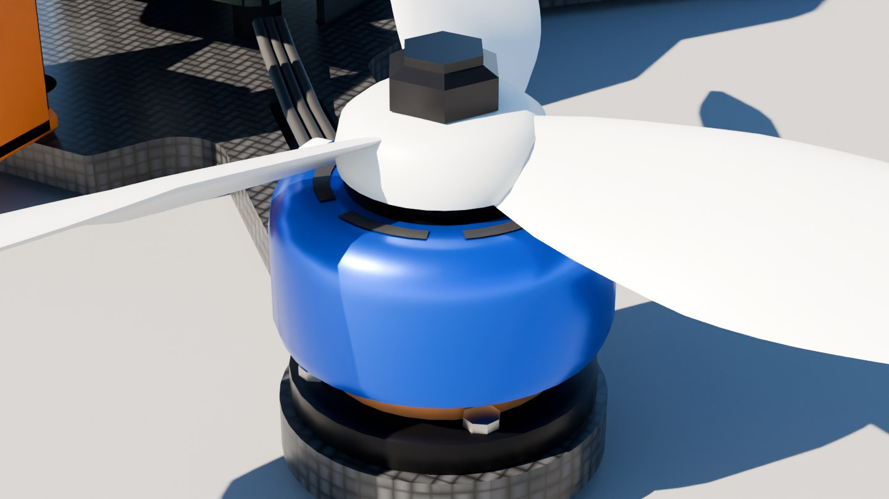
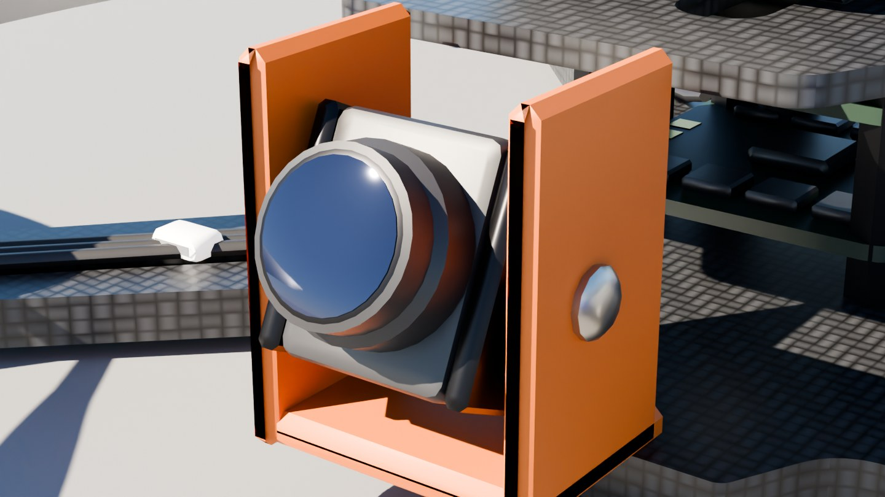
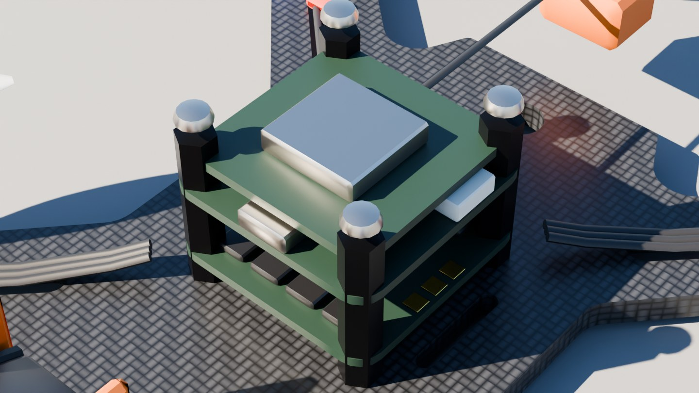
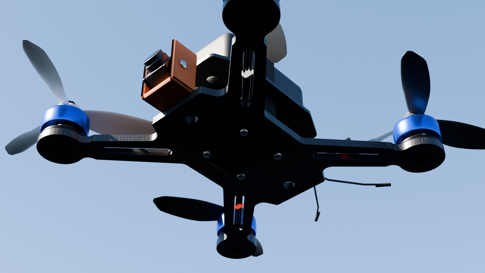

# 5-inch freestyle FPV quadcopter

A generic 5-inch freestyle FPV quad at 1:1 scale, for a game: a 220 mm carbon frame with slotted arms, four 2306-class motors with tri-blade props that spin as their own nodes, a 6S 1300 mAh pack on a strap, a tilted 19 mm micro camera in a printed cage, a three-board stack (ESC, flight controller, video transmitter), a VTX antenna and two receiver wires. It carries nothing else: no payload of any kind.



| Top | Side |
| --- | --- |
|  |  |
| **Front** | **Rear** |
|  |  |
| **Motor and prop** | **Camera and cage** |
|  |  |
| **Stack** (top plate and battery off) | **Underside** |
|  |  |

## Files

| File | What it is |
| --- | --- |
| `fpv_drone.glb` | **The quad.** 47 meshes in 54 nodes, textured, with each rotor (bell, prop and nut) a node pivoted on its motor axis. 0.9 MB. |
| `measurements.json` | The finished model measured against the class's nominal dimensions. |
| `build.py`, `parts.py`, `drone.py`, `textures.py` | The Blender build. It uses the shared `../modelkit`. |

## Scale: 1:1

It is a generic quad of the class, not a particular product: `drone.py` holds the nominal figures and `build.py` measures the finished geometry against every one of them on each build.

| Dimension | Nominal (m) | Model (m) |
| --- | ---: | ---: |
| Motor to motor, diagonal | 0.2200 | 0.2200 |
| Motor to motor, side by side | 0.1556 | 0.1556 |
| Prop diameter (5 in) | 0.1270 | 0.1271 |
| Stack mount, standoff to standoff | 0.0305 | 0.0305 |
| Plate gap (standoff length) | 0.0280 | 0.0280 |
| Arm thickness | 0.0050 | 0.0050 |
| Battery length | 0.0760 | 0.0760 |
| Battery width | 0.0390 | 0.0390 |
| Battery height | 0.0360 | 0.0360 |
| Camera width | 0.0190 | 0.0190 |

Overall it is 0.283 m wide and 0.267 m long over the props, and 0.088 m from the floor to the tip of the VTX antenna.

- **Units and axes:** metres, glTF axes. +Y is up, +Z points to the front (the camera), and +X is the left.
- **Origin:** the middle of the frame, on the centreline, halfway between the plates, where the motor diagonals cross. That is also close to the centre of mass, so it suits a rigid body. `Ground_Reference` marks the lowest point, 20.9 mm below the origin, where the quad rests on a floor.
- **Mass:** 0.65 kg with the pack (`mass_kg` on the root node; the pack alone is 0.215 kg, on `Battery`).

## Moving parts

Each rotor is its own node, pivoted on its motor's axis, so spinning it is one rotation about local Y. Its glTF extras say how.

| Node | Moves |
| --- | --- |
| `Rotor_FL`, `Rotor_FR`, `Rotor_RL`, `Rotor_RR` | spin about local Y (`axis` is `[0, 1, 0]`). Each holds its `_Bell`, `_Prop` and `_Nut` meshes. Extras: `control: prop`, `spin` (+1 is counter-clockwise seen from above, −1 clockwise), `motor` (1 to 4, in the usual flight-controller order), `position`, `max_rpm` (32 000) and `prop` (5 × 4.1 × 3) |
| `Light_FL`, `Light_FR`, `Light_RL`, `Light_RR` | an orientation LED on each arm, white at the front and red at the back. Their materials `Light_White` and `Light_Red` are emissive, so scale the emission to switch them (`control: light`) |
| `FPV_Camera_Point` | an empty at the front of the lens. Put a game camera here and point it along its `forward` extra (tilted up `tilt_deg`, 25°) for a first-person view |

The spin directions follow the usual quad-X layout: front-left and rear-right turn counter-clockwise, front-right and rear-left clockwise. The front props are pale and the rear ones dark, so which way it is facing reads at a glance in flight.

A clockwise prop is the mirror image of a counter-clockwise one, so spinning each by its `spin` sign gives the right blade motion with no further setup. In three.js:

```js
const rotors = ["FL", "FR", "RL", "RR"].map((t) => gltf.scene.getObjectByName(`Rotor_${t}`));
// each frame, with `rpm` from the game's throttle:
for (const r of rotors) r.rotation.y += r.userData.spin * (rpm / 60) * 2 * Math.PI * dt;
```

Everything else is static, with its own node for each part: `Frame_Bottom`, `Frame_Top`, `Standoff_*`, `Screw_*`, `Stack_ESC`, `Stack_FC`, `Stack_VTX`, `Motor_*_Stator`, `Motor_Wires`, `Battery`, `Battery_Strap`, `Battery_Pad`, `Battery_Lead`, `Battery_XT60`, `Camera_Body`, `Camera_Lens`, `Camera_Mount`, `Antenna_VTX`, `Antenna_VTX_Coax`, `Antenna_RX_L`, `Antenna_RX_R` and `Antenna_Mount`. Hide or swap any of them freely: the top plate and battery come off cleanly to show the stack.

## Look

- **Carbon frame:** a 2×2 twill weave, drawn in code (`textures.py`), on the plates and arms. The arms are slotted, taper from 25 mm at the root to 18 mm and flare to a round 29 mm end that holds the motor on a 16 × 16 mount pattern.
- **Motors:** blue anodised bells with six dark vent windows, copper windings showing under the bell, a black base with four screws, and a hex prop nut.
- **Props:** lofted tri-blade, with a pitched, cambered airfoil section along each blade, 5 in across.
- **Battery:** a charcoal wrap with a plain, generic label (6S 22.2 V, 1300 mAh), a rubber pad, an orange-tabbed strap through slots in both plates and an XT60.
- **Camera:** a micro camera with its glass lens, in an orange printed cage, tilted up 25°.
- **Stack:** an ESC with its capacitors and power stages, a flight controller with its USB-C port and connectors, and a VTX under a shield can.

Two images, a carbon weave (512²) and the battery label (1024 × 512), are embedded in the file; every other material is a plain value.

## Performance

| File | Triangles | Draw calls | Nodes | Materials | Textures |
| --- | ---: | ---: | ---: | ---: | --- |
| `fpv_drone.glb` | 30 832 | 78 | 54 | 25 | 2 (512², 1024 × 512) |

It is a hero-quality asset, built to be looked at closely. For a distant or swarm use, merge the static parts into one mesh per material (roughly 25 draw calls), or drop the stack, screws and wires, which sit between the plates and can't be seen from outside at range.

## Rebuilding

```sh
pip install bpy==5.0.1 pillow shapely          # once, with Python 3.11
python3.11 fpv-drone/build.py --glb fpv-drone/fpv_drone.glb                  # build, check, export
python3.11 fpv-drone/build.py --preview out --samples 64 --views hero,top    # the renders
```

`build.py` also runs an audit and prints what it found (`audit: 0 problems`). It checks that every face points outward, that there are no zero-area faces, open edges or duplicate node names, that every rotor's meshes sit on its motor axis, that textured parts have UVs, and that no two props overlap.
