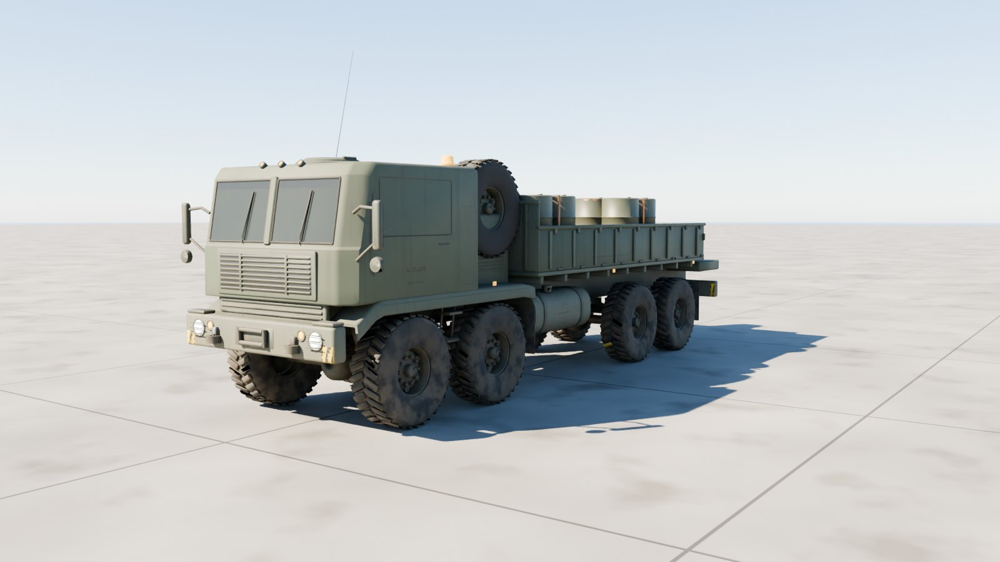
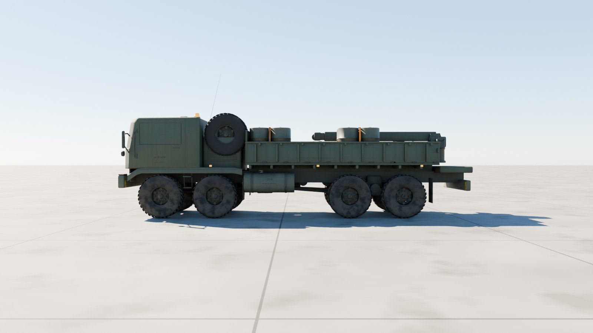
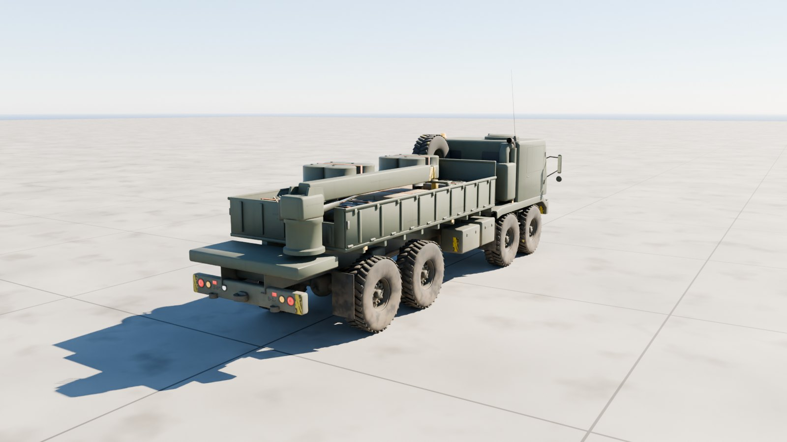
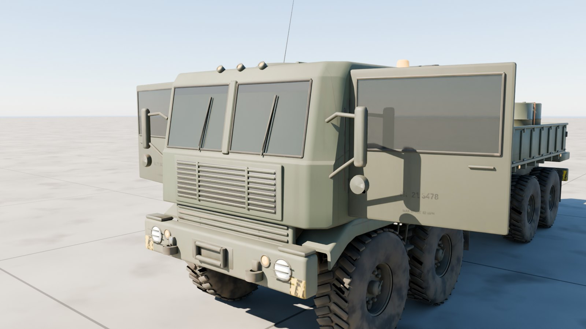
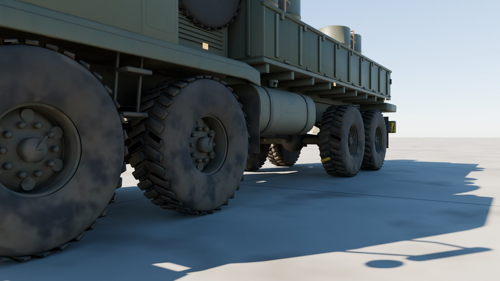
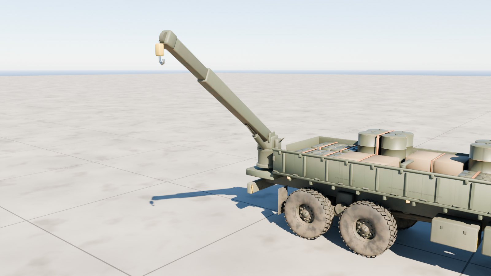

# HEMTT M977A4 cargo truck

A game-ready US Army HEMTT M977A4: the 8×8 Heavy Expanded Mobility Tactical Truck with its 18 ft cargo body and rear material-handling crane, carrying eight pallets of resources. Outside only, at 1:1 scale.



| Side | Rear and crane |
| --- | --- |
|  |  |
| **Cab** | **Running gear** |
|  |  |
| **Crane** |
|  |

## Files

| File | What it is |
| --- | --- |
| `hemtt_m977a4.glb` | **The truck.** Textured, with every wheel, the steering, the doors, the crane and each pallet load its own node. 17.7 MB. |
| `hemtt_m977a4_web.glb` | A lighter copy with half-size WebP textures, for browsers and phones. 8.1 MB. |
| `hemtt_m977a4_viewer.html` | Opens the truck in your browser with a double-click: orbit round it, drive and steer it, open the doors, slew and raise the crane (it lifts itself over the load), run out its boom and let down the hook, and unload the cargo. 11.4 MB; not checked in, `node modelkit/finish.mjs` makes it. |
| `measurements.json` | The finished model measured against the published dimensions. |
| `build.py`, `truck.py`, `markings.py`, `m977.py` | The Blender build (it uses the shared `../modelkit`). |

## Scale: 1:1

Built to Oshkosh's published M977A4 figures; `build.py` measures the finished geometry against them on every build, the approach angle included:

| Dimension | Published (m) | Model (m) |
| --- | ---: | ---: |
| Length (over the spare tyre) | 10.211 | 10.211 |
| Width (without mirrors) | 2.438 | 2.435 |
| Height (over the spare tyre) | 2.997 | 2.995 |
| Wheelbase (axle pair to axle pair) | 5.334 | 5.334 |
| Track | 2.007 | 2.007 |
| Tyre diameter (16.00R20) | 1.240 | 1.238 |
| Cargo body length (18 ft) | 5.486 | 5.486 |
| Approach angle | 41.0° | 40.8° |

All within 4 mm, the angles within 0.2°.

- **Units and axes:** metres, glTF axes. +Y is up, +Z points to the front, and +X is the left.
- **Origin:** on the ground, on the centreline, midway between the front and rear axle pairs.

## Moving parts

Each is its own node, pivoted where the real part turns. Its glTF extras say how it moves: `control` (wheel, steer, track, hinge, traverse, elevate, cargo), `axis`, `limits`, and `drive` in words.

The gun also carries `limits_by_traverse`: its lowest and highest elevation every `traverse_step` (5) degrees of the turret's traverse, measured against the hull, so a game can lift it over the deck and whatever else stands in its way instead of letting it sink through. The viewer clamps to it.

| Node | Moves |
| --- | --- |
| `Wheel_{1-4}_{Left,Right}` | spin about local X; + rolls forward (radius 0.62 m) |
| `Steer_{1,2}_{Left,Right}` | steer about local Y; + turns left. Full lock is the inner wheels' for the published 100 ft turning circle: 27° on the first axle, 21° on the second. The wheels sit inside these nodes. |
| `Door_Left`, `Door_Right` | swing about `axis` on hinges on their outer skins; + opens (to 80°, group `Cab doors`) |
| `Crane` | slews about local Y, all the way round (`control` traverse) |
| `Crane_Boom` | luffs about its `axis`; + raises it, to 74° (`control` elevate). Its `limits_by_traverse` say how high it must be to slew over the load. |
| `Crane_Boom_Extension` | telescopes along local +Z, up to 2.3 m (group `Crane reach`) |
| `Crane_Hook` | lets down on its cable, up to 3 m, straight down whatever the boom does (`gravity`; group `Crane reach`) |
| `Cargo_Pallet_1` … `_8` | the resources, one pallet load each: drums of fuel, ammunition cans, crates and rations (`control` cargo) |
| `Spare_Tire` | on its carrier behind the cab |
| `Light_*` | head, turn, tail, reverse, clearance lights and the amber beacon; their lens materials `Light_White`, `Light_Amber` and `Light_Red` are emissive, so scale the emission to switch them |

## Look

- **Paint:** CARC green with the panel seams and bolt rows of its cab, engine bay and body.
- **Stencils:** a black registration number, the CTIS tyre pressures, the weight class, JP-8 and NO SMOKING, the crane's load chart and DANGER, and bumper codes.
- **Hazard stripes:** yellow and black on both bumpers and the crane boom.
- **Weathering:** mud thrown up by every wheel, dust settling low down and on top, exhaust soot round the stack, grime in the corners and worn edges.

| Texture set | Size | Covers |
| --- | --- | --- |
| `HEMTT_Paint_Front` | 4096² | Cab, doors, front end, fenders, engine bay, wheels' paint |
| `HEMTT_Paint_Back` | 4096² | Cargo body, rear end, crane, fuel tank and boxes |
| `HEMTT_Chassis` | 2048² | Frame, axles and springs, tyres, exhaust, steel |
| `HEMTT_Cargo` | 2048² | Pallets, drums, ammunition cans, crates, straps, ration cases |

Each set has a base colour, an occlusion-roughness-metallic map and a normal map (MikkTSpace tangents included). Glass, optics and light lenses use plain material values.

## Performance

| File | Triangles | Draw calls | Nodes | Textures | Texture memory on the GPU |
| --- | ---: | ---: | ---: | --- | ---: |
| `hemtt_m977a4.glb` | 126,108 | 125 | 112 | 6 at 4096², 6 at 2048² | about 640 MB |
| `hemtt_m977a4_web.glb` | 126,108 | 125 | 112 | 12 at 1024² | about 64 MB |

Texture memory assumes uncompressed RGBA with mipmaps; GPU texture compression (KTX2/Basis, BCn or ASTC) cuts it by four to eight times.

## Rebuilding

```sh
pip install bpy==5.0.1 pillow                     # once, with Python 3.11
(cd apache-cockpit && npm install)                # once: glTF-Transform, sharp, esbuild, three
python3.11 hemtt-m977/build.py --glb out/hemtt_m977a4.glb --textures 4096   # build, paint, bake, export
node modelkit/finish.mjs out/hemtt_m977a4.glb hemtt-m977 hemtt_m977a4            # game and web files, the viewer
python3.11 modelkit/beauty.py hemtt-m977 hemtt-m977/hemtt_m977a4.glb out/docs     # the renders
python3.11 hemtt-m977/build.py --preview out --lookdev    # a quick look at the paint, without baking
```

## Accuracy

- **Published dimensions:** the overall length, width and height, wheelbase, track, tyre size, cargo body length, the 41° approach angle and the 100 ft turning circle (as the steering locks) all match.
- **Departure angle:** Oshkosh quotes 45° for the HEMTT family; with the M977's published length, wheelbase and 18 ft body, the body's back end sits over 2 m behind the last axle, so the model's departure angle is about 22°.
- **Estimated:** the spacing within each axle pair, the cab and body heights, and the layout behind the cab.
- **Markings:** plausible but made up; the registration and unit codes aren't a real vehicle's.
