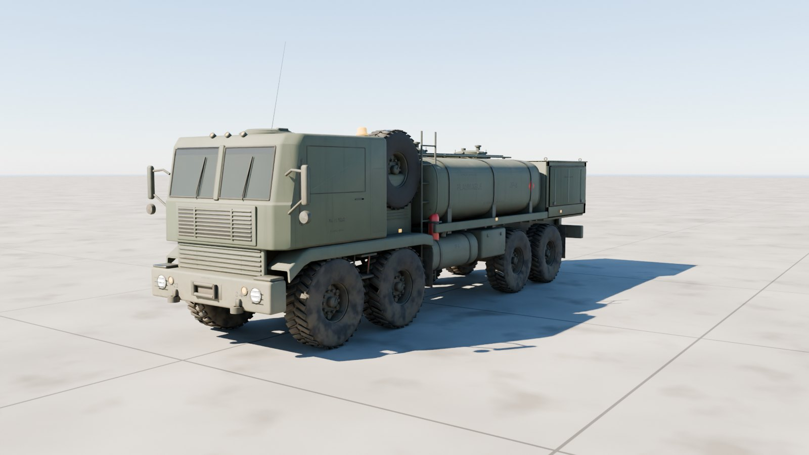
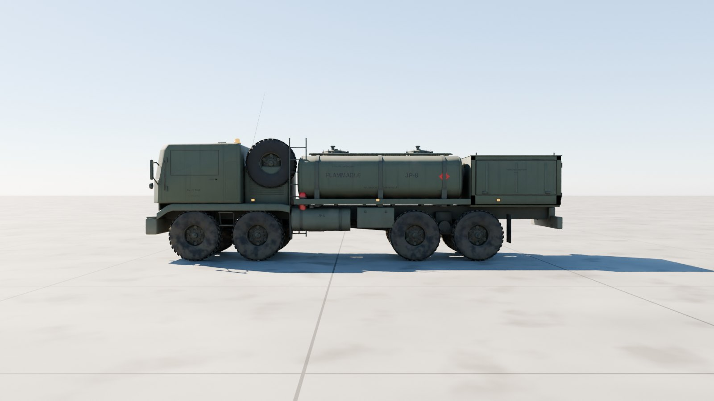
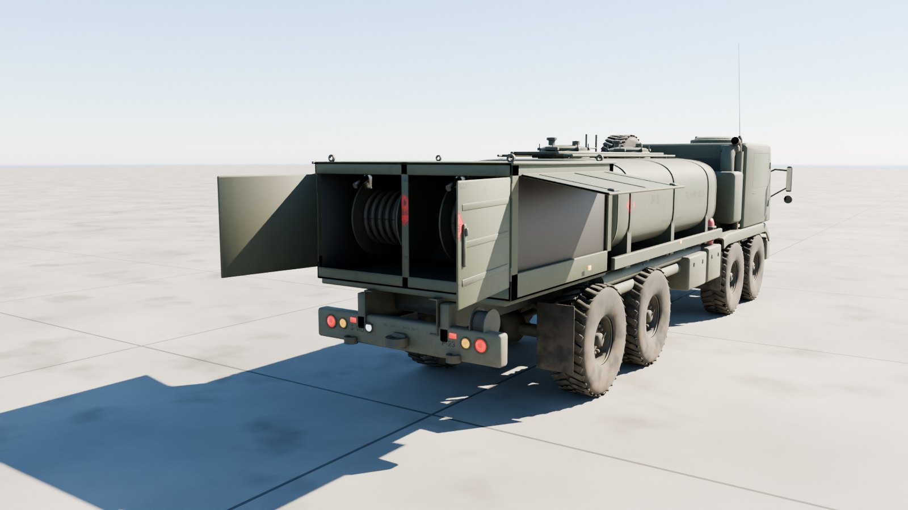
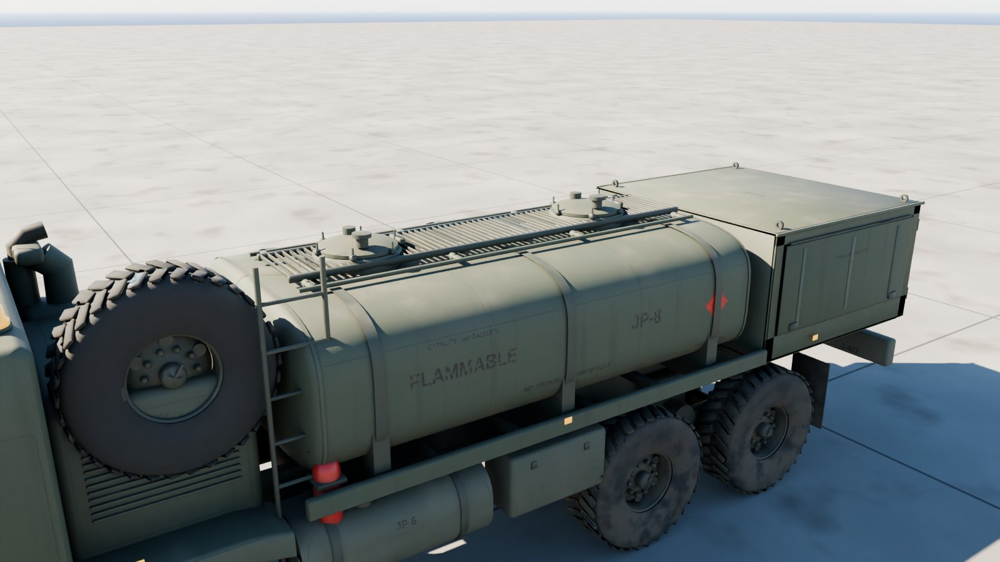
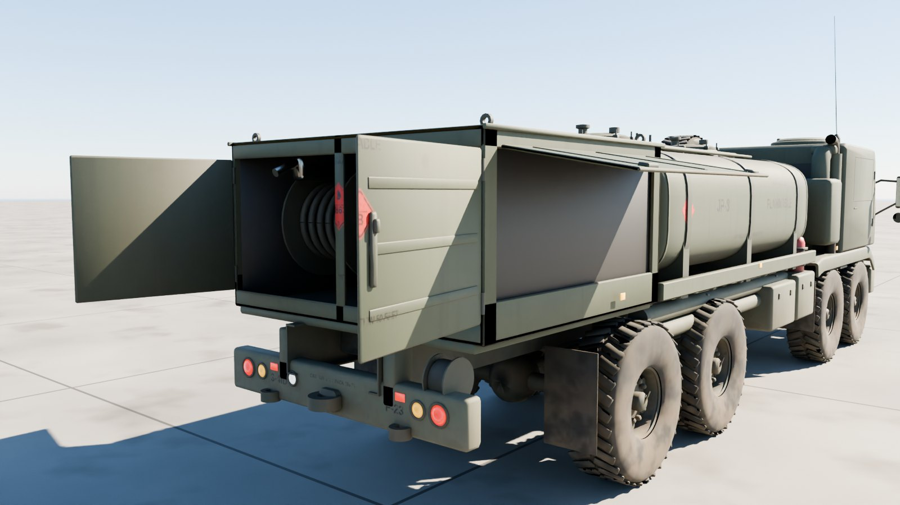

# HEMTT M978A4 fuel tanker

The US Army's HEMTT M978A4 fuel servicing truck at 1:1 scale, outside only: the M977's cab, frame and 8×8 running gear (shared with `../hemtt-m977`) under a 2,500 US gallon tank with its catwalk, manholes and fold-down handrails, and the rear pump module with its hose reels, pump, filter-separator and meters behind four doors.



| Side | Pump module |
| --- | --- |
|  |  |
| **Tank** | **Hose reels** |
|  |  |

## Files

| File | What it is |
| --- | --- |
| `hemtt_m978a4.glb` | **The tanker.** Textured, with the doors, pump doors, hose reels and every wheel and its steering its own node. 16.1 MB. |
| `hemtt_m978a4_web.glb` | A lighter copy with half-size WebP textures, for browsers and phones. 8.0 MB. |
| `hemtt_m978a4_viewer.html` | Opens the tanker in your browser with a double-click: orbit round it, drive and steer it, open the cab and pump doors. 11.2 MB; not checked in, `node modelkit/finish.mjs` makes it. |
| `measurements.json` | The finished model measured against the published dimensions. |
| `build.py`, `tanker.py`, `markings.py`, `m978.py` | The Blender build (it uses the shared `../modelkit`). |

## Scale: 1:1

Built to Oshkosh's published M978A4 figures; `build.py` measures the finished geometry against them on every build, and the tank's shell holds 2,500 US gallons:

| Dimension | Published (m) | Model (m) |
| --- | ---: | ---: |
| Length | 10.389 | 10.389 |
| Width (without mirrors) | 2.438 | 2.435 |
| Height (over the spare tyre) | 2.997 | 2.995 |
| Wheelbase (axle pair to axle pair) | 5.334 | 5.334 |
| Track | 2.007 | 2.007 |
| Tyre diameter (16.00R20) | 1.240 | 1.238 |
| Tank, m3 (2,500 US gal) | 9.463 | 9.463 |

All within 4 mm.

- **Units and axes:** metres, glTF axes. +Y is up, +Z points to the front, and +X is the left.
- **Origin:** on the ground, on the centreline, midway between the front and rear axle pairs.

## Moving parts

Each is its own node, pivoted where the real part turns. Its glTF extras say how it moves: `control` (wheel, steer, track, hinge, traverse, elevate, cargo), `axis`, `limits`, and `drive` in words.

| Node | Moves |
| --- | --- |
| `Wheel_{1-4}_{Left,Right}` | spin about local X; + rolls forward (radius 0.62 m) |
| `Steer_{1,2}_{Left,Right}` | steer about local Y; + turns left; the second axle turns about two thirds as far as the first |
| `Door_Left`, `Door_Right` | the cab doors swing about `axis` on their front hinges (group `Cab doors`) |
| `Pump_Door_{Left,Right}`, `Pump_Side_Door_{Left,Right}` | the pump module's rear doors swing out on their outer hinges; its side doors lift on their tops (group `Pump doors`) |
| `Hose_Reel_1`, `Hose_Reel_2` | turn about local X to pay the hose out |
| `Spare_Tire` | on its carrier behind the cab |
| `Light_*` | head, blackout and tail lights; their lens materials `Light_White`, `Light_Amber` and `Light_Red` are emissive, so scale the emission to switch them |

## Look

- **Paint:** CARC green 383 with the tank's welded sheet seams and the cab's panels.
- **Markings:** red FLAMMABLE placards with UN 1863, JP-8, CAPACITY 2500 GALLONS, NO SMOKING WITHIN 50 FEET, the registration and bumper codes.
- **Weathering:** mud thrown up by every wheel, fuel stains running down from the manholes, dust and exhaust soot.

| Texture set | Size | Covers |
| --- | --- | --- |
| `M978_Paint_Front` | 4096² | Cab, doors, front end, engine bay, fuel tank and boxes |
| `M978_Paint_Back` | 4096² | The tank, catwalk, manholes, pump module and its doors, rear end |
| `M978_Chassis` | 2048² | Frame and running gear, tyres, hoses, extinguishers, steel |

Each set has a base colour, an occlusion-roughness-metallic map and a normal map (MikkTSpace tangents included). Glass, optics and light lenses use plain material values.

## Performance

| File | Triangles | Draw calls | Nodes | Textures | Texture memory on the GPU |
| --- | ---: | ---: | ---: | --- | ---: |
| `hemtt_m978a4.glb` | 134,932 | 115 | 110 | 6 at 4096², 3 at 2048² | about 576 MB |
| `hemtt_m978a4_web.glb` | 134,932 | 115 | 110 | 9 at 1024² | about 48 MB |

Texture memory assumes uncompressed RGBA with mipmaps; GPU texture compression (KTX2/Basis, BCn or ASTC) cuts it by four to eight times.

## Rebuilding

```sh
pip install bpy==5.0.1 pillow                     # once, with Python 3.11
(cd apache-cockpit && npm install)                # once: glTF-Transform, sharp, esbuild, three
python3.11 hemtt-m978/build.py --glb out/hemtt_m978a4.glb --textures 4096   # build, paint, bake, export
node modelkit/finish.mjs out/hemtt_m978a4.glb hemtt-m978 hemtt_m978a4            # game and web files, the viewer
python3.11 modelkit/beauty.py hemtt-m978 hemtt-m978/hemtt_m978a4.glb out/docs     # the renders
python3.11 hemtt-m978/build.py --preview out --lookdev    # a quick look at the paint, without baking
```

## Accuracy

- **Published dimensions:** length, width, height over the spare tyre, wheelbase, track, the tyres and the tank's capacity all match.
- **Estimated:** the tank's shape and length (sized to hold 2,500 gal), the pump module's layout and the fittings.
- **Markings:** plausible but made up; the registration isn't a real truck's.
