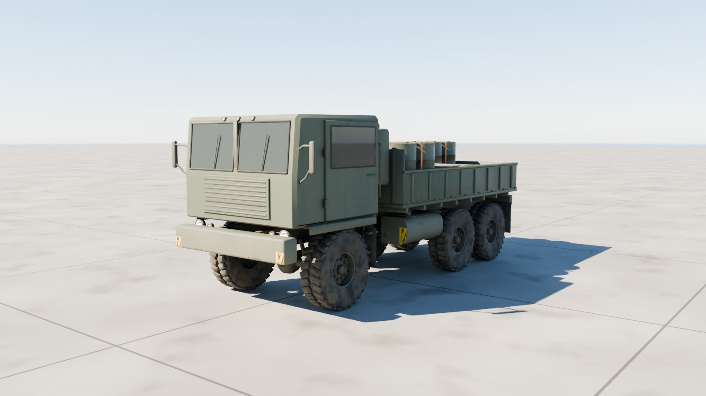
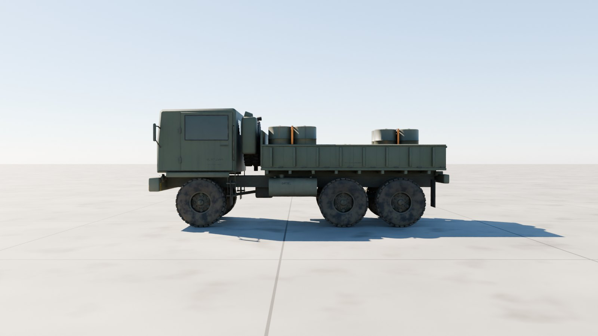
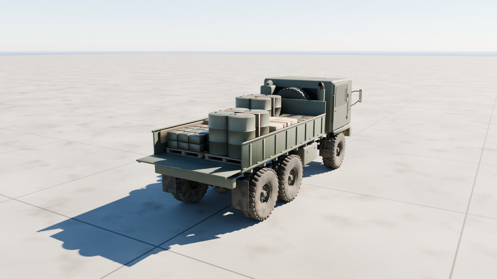
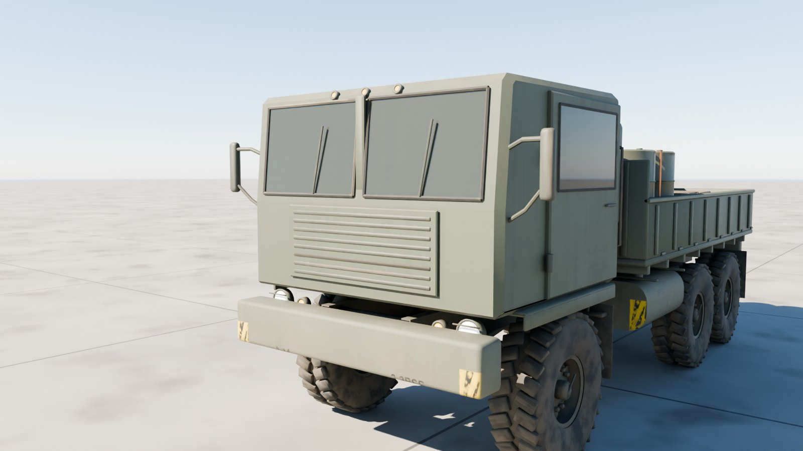
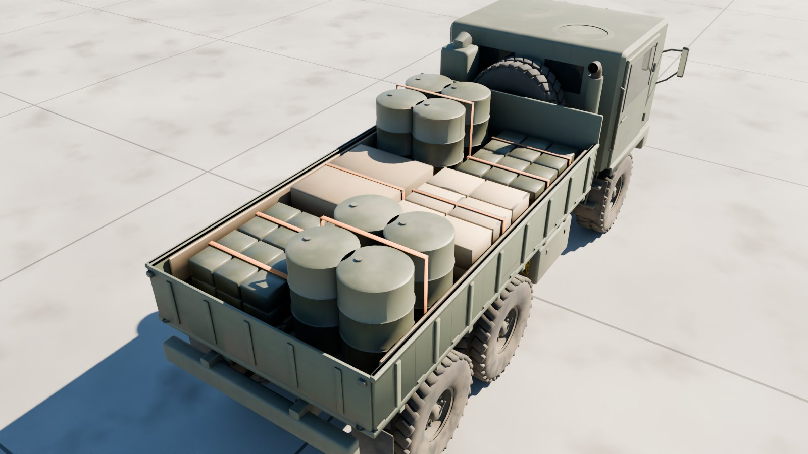

# M1083A1P2 FMTV

The US Army's M1083A1P2 Family of Medium Tactical Vehicles 5-ton cargo truck at 1:1 scale, outside only: the flat-fronted cab over the engine, the 6×6 running gear on 395/85R20 tyres, the drop-side cargo body and its tailgate, and six pallet loads of supplies: fuel drums, ammunition, crates and rations.



| Side | Rear, tailgate down |
| --- | --- |
|  |  |
| **Cab** | **Cargo** |
|  |  |

## Files

| File | What it is |
| --- | --- |
| `m1083_fmtv.glb` | **The truck.** Textured, with the doors, tailgate, every wheel and the steering, and each pallet load its own node. 13.0 MB. |
| `m1083_fmtv_web.glb` | A lighter copy with half-size WebP textures, for browsers and phones. 4.9 MB. |
| `m1083_fmtv_viewer.html` | Opens the truck in your browser with a double-click: orbit round it, drive and steer it, open the doors and the tailgate, unload and reload the pallets. 7.1 MB; not checked in, `node modelkit/finish.mjs` makes it. |
| `measurements.json` | The finished model measured against the published dimensions. |
| `build.py`, `parts.py`, `markings.py`, `fmtv.py` | The Blender build (it uses the shared `../modelkit`). |

## Scale: 1:1

Built to the published M1083A1P2 figures; `build.py` measures the finished geometry against them on every build, the approach and departure angles included:

| Dimension | Published (m) | Model (m) |
| --- | ---: | ---: |
| Length | 7.206 | 7.206 |
| Width (without mirrors) | 2.438 | 2.444 |
| Height (to the cab roof) | 2.845 | 2.844 |
| Wheelbase (to the rear pair's centre) | 4.100 | 4.100 |
| Tyre diameter (395/85R20) | 1.179 | 1.183 |
| Cargo bed, inside length | 4.318 | 4.318 |
| Cargo bed, inside width | 2.311 | 2.311 |
| Approach angle | 40.0° | 40.2° |
| Departure angle | 49.0° | 49.2° |

All within 6 mm, the angles within 0.2°.

- **Units and axes:** metres, glTF axes. +Y is up, +Z points to the front, and +X is the left.
- **Origin:** on the ground, on the centreline, midway between the front axle and the centre of the rear pair.

## Moving parts

Each is its own node, pivoted where the real part turns. Its glTF extras say how it moves: `control` (wheel, steer, track, hinge, traverse, elevate, cargo), `axis`, `limits`, and `drive` in words.

| Node | Moves |
| --- | --- |
| `Door_Left`, `Door_Right` | swing about `axis` on hinges on their outer skins, at their front edges; + opens them outward (group `Doors`) |
| `Tailgate` | drops about local X at its foot (group `Tailgate`) |
| `Wheel_{1-3}_{Left,Right}` | spin about local X; + rolls forward (radius in the extras) |
| `Steer_1_{Left,Right}` | steer about local Y; + turns left. Full lock is the inner wheel's for the published 65.6 ft turning circle (30°). The front wheels sit inside these nodes. |
| `Cargo_Pallet_1` … `_6` | the supplies, one pallet load each: lift one off, hide it, or reload (`control: cargo`) |
| `Spare_Tire` | on its carrier between the cab and the body, facing back |
| `Light_*` | head, blackout and tail lights; their lens materials `Light_White`, `Light_Amber` and `Light_Red` are emissive, so scale the emission to switch them |

## Look

- **Paint:** CARC green 383 with the cab's and body's seams. Rebuild with `--scheme tan` for desert tan.
- **Markings:** the registration (NL 07 2265), bumper codes (2-3BSB, A-14), the tyre pressures and the troop seats' stencil.
- **Hazard stripes:** yellow and black on the bumpers' ends.
- **Weathering:** mud thrown up by every wheel, dust low down and on top, soot round the exhaust, scuffs on the bed.

| Texture set | Size | Covers |
| --- | --- | --- |
| `M1083_Paint_Front` | 4096² | Cab, doors, bumper, fenders, intake and exhaust |
| `M1083_Paint_Back` | 4096² | Cargo body, tailgate, rear end, fuel tank, battery box |
| `M1083_Chassis` | 2048² | Frame, axles and springs, wheels and tyres, exhaust |
| `M1083_Cargo` | 2048² | Pallets, drums, ammunition cans, crates, straps, ration cases |

Each set has a base colour, an occlusion-roughness-metallic map and a normal map (MikkTSpace tangents included). Glass, optics and light lenses use plain material values.

## Performance

| File | Triangles | Draw calls | Nodes | Textures | Texture memory on the GPU |
| --- | ---: | ---: | ---: | --- | ---: |
| `m1083_fmtv.glb` | 84,360 | 96 | 89 | 6 at 4096², 6 at 2048² | about 640 MB |
| `m1083_fmtv_web.glb` | 84,360 | 96 | 89 | 12 at 1024² | about 64 MB |

Texture memory assumes uncompressed RGBA with mipmaps; GPU texture compression (KTX2/Basis, BCn or ASTC) cuts it by four to eight times.

## Rebuilding

```sh
pip install bpy==5.0.1 pillow                     # once, with Python 3.11
(cd apache-cockpit && npm install)                # once: glTF-Transform, sharp, esbuild, three
python3.11 m1083-fmtv/build.py --glb out/m1083_fmtv.glb --textures 4096   # build, paint, bake, export
node modelkit/finish.mjs out/m1083_fmtv.glb m1083-fmtv m1083_fmtv            # game and web files, the viewer
python3.11 modelkit/beauty.py m1083-fmtv m1083-fmtv/m1083_fmtv.glb out/docs     # the renders
python3.11 m1083-fmtv/build.py --preview out --lookdev    # a quick look at the paint, without baking
```

## Accuracy

- **Published dimensions:** length, width, operational height, wheelbase, the tyres, the cargo bed's inside length and width, the 40° approach and 49° departure angles and the 65.6 ft turning circle (as the steering lock) all match.
- **Estimated:** the rear pair's spacing, the track, the cab's shape and the layout behind it.
- **Markings:** plausible but made up.
