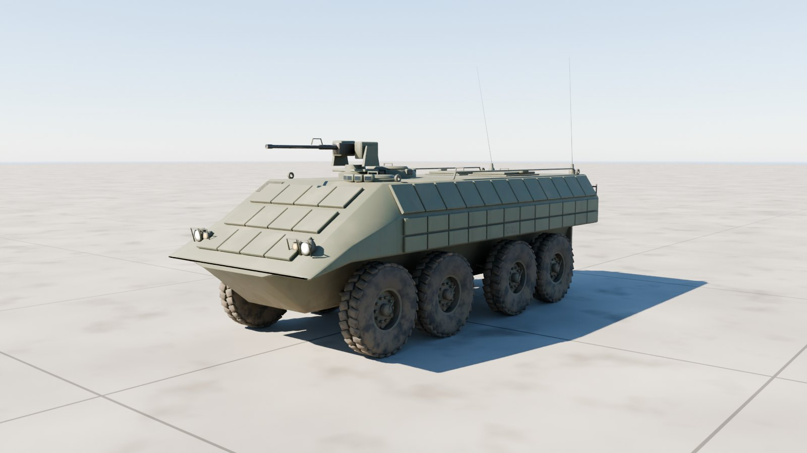
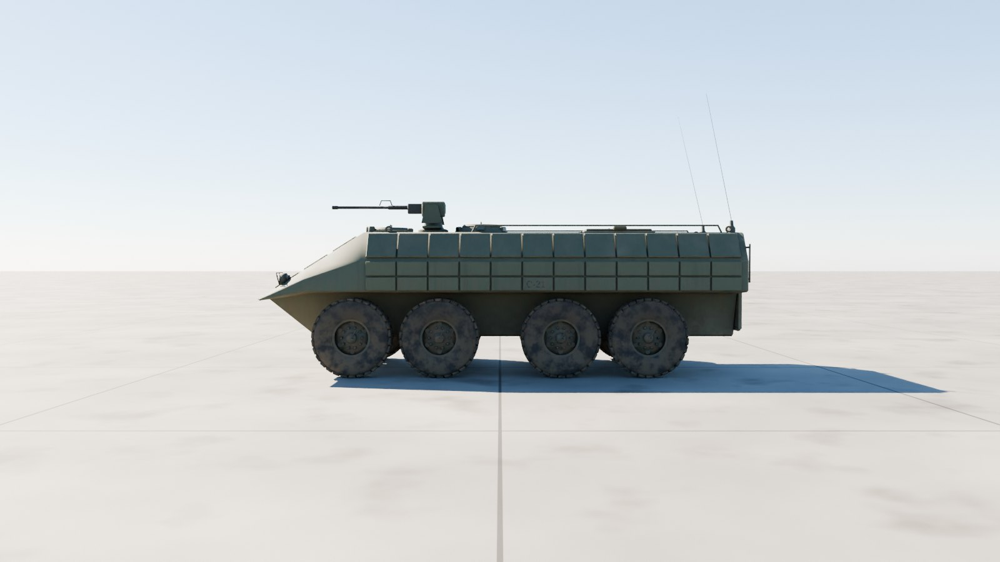
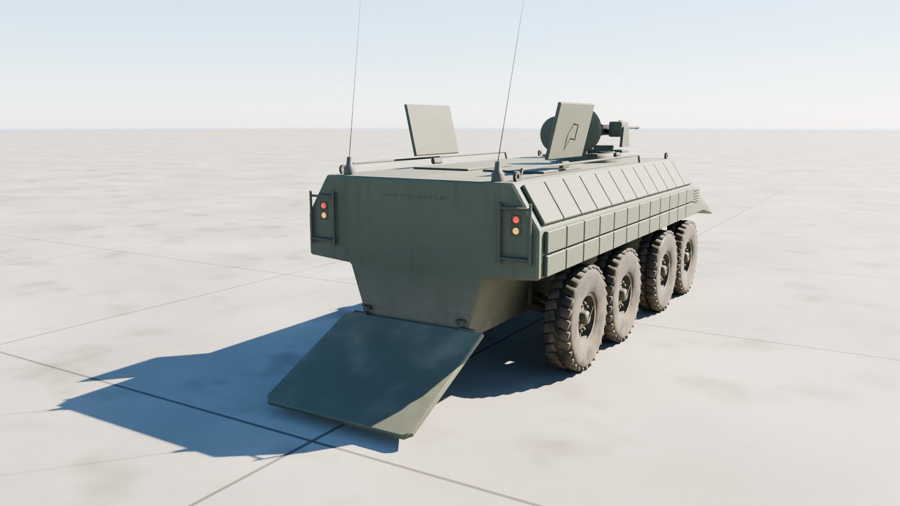
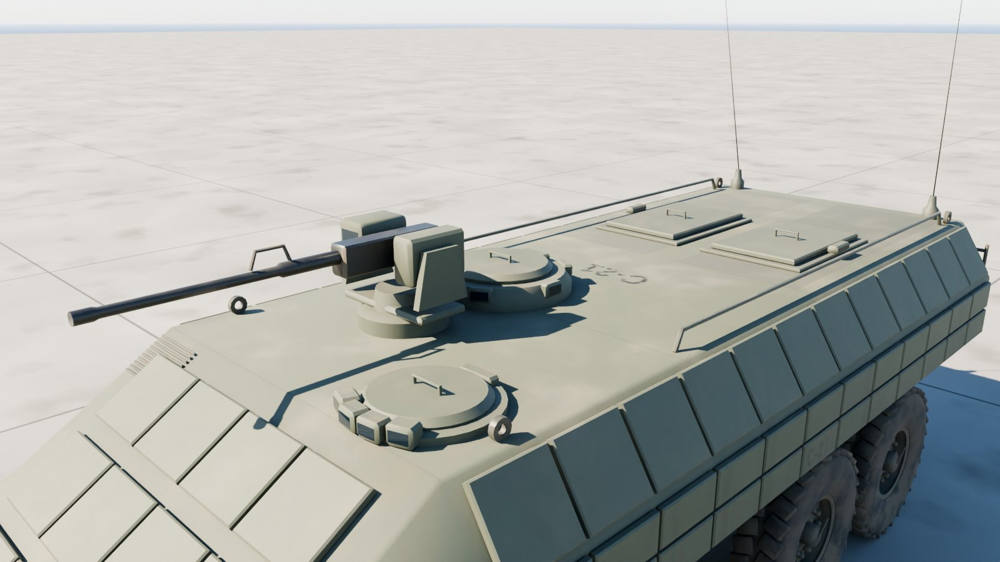
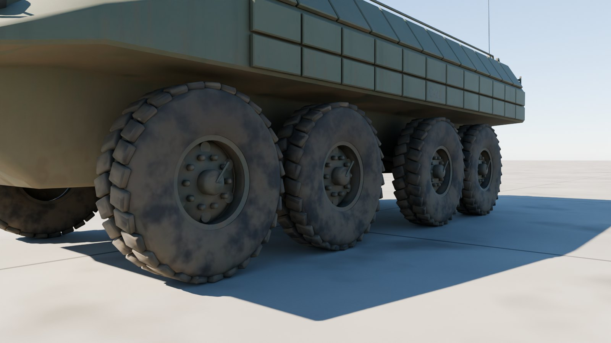

# M1126 Stryker ICV

The US Army's M1126 Stryker infantry carrier vehicle at 1:1 scale, outside only: the faceted hull with its bolted ceramic armour tiles, the M151 Protector remote weapon station with an M2, the driver's and commander's stations, roof hatches, the rear ramp for nine infantry, and eight wheels on Michelin 12.00R20 XML tyres.



| Side | Rear, ramp down |
| --- | --- |
|  |  |
| **Weapon station** | **Wheels** |
|  |  |

## Files

| File | What it is |
| --- | --- |
| `m1126_stryker.glb` | **The Stryker.** Textured, with the weapon station, ramp, hatches and every wheel and its steering its own node. 9.2 MB. |
| `m1126_stryker_web.glb` | A lighter copy with half-size WebP textures, for browsers and phones. 4.0 MB. |
| `m1126_stryker_viewer.html` | Opens the Stryker in your browser with a double-click: orbit round it, drive and steer it, slew and elevate the weapon station, lower the ramp and open the hatches. 5.9 MB; not checked in, `node modelkit/finish.mjs` makes it. |
| `measurements.json` | The finished model measured against the published dimensions. |
| `build.py`, `parts.py`, `markings.py`, `stryker.py` | The Blender build (it uses the shared `../modelkit`). |

## Scale: 1:1

Built to the published M1126 figures; `build.py` measures the finished geometry against them on every build:

| Dimension | Published (m) | Model (m) |
| --- | ---: | ---: |
| Length | 6.950 | 6.962 |
| Width | 2.720 | 2.720 |
| Height (to the top of the weapon station) | 2.640 | 2.628 |
| Ground clearance | 0.530 | 0.530 |
| Tyre diameter (12.00R20) | 1.130 | 1.132 |
| Tyre width | 0.310 | 0.316 |

All within 12 mm.

- **Units and axes:** metres, glTF axes. +Y is up, +Z points to the front, and +X is the left.
- **Origin:** on the ground, on the centreline, midway between the first and last axles.

## Moving parts

Each is its own node, pivoted where the real part turns. Its glTF extras say how it moves: `control` (wheel, steer, track, hinge, traverse, elevate, cargo), `axis`, `limits`, and `drive` in words.

The gun also carries `limits_by_traverse`: its lowest and highest elevation every `traverse_step` (5) degrees of the turret's traverse, measured against the hull, so a game can lift it over the deck and whatever else stands in its way instead of letting it sink through. The viewer clamps to it.

| Node | Moves |
| --- | --- |
| `RWS` | the M151 Protector: slews about local Y; + turns it left |
| `RWS_Cradle` | the M2 and its sights: elevate about (−1, 0, 0); + raises them, −20° to +60°; its `limits_by_traverse` keep the gun off the hull, down to −12° over the front corners |
| `Wheel_{1-4}_{Left,Right}` | spin about local X; + rolls forward (radius in the extras) |
| `Steer_{1,2}_{Left,Right}` | steer about local Y; + turns left. Full lock is the inner wheels' for the published 52 ft turning circle: 37° on the first axle, 26° on the second. The wheels sit inside these nodes. |
| `Ramp` | lowers about local X at its foot (group `Ramp`); `Ramp_Door` opens in it (group `Ramp door`) |
| `Driver_Hatch`, `Commander_Hatch`, `Troop_Hatch_{Left,Right}` | open about their hinges (group `Hatches`) |
| `Light_*` | head, blackout and tail lights; their lens materials `Light_White`, `Light_Amber` and `Light_Red` are emissive, so scale the emission to switch them |

## Look

- **Paint:** CARC green 383 with the armour tiles' bolts and non-skid on the roof. Rebuild with `--scheme tan` for desert tan.
- **Markings:** bumper codes (1-23IN, C-21) and the vehicle number on the sides and roof.
- **Weathering:** mud thrown up by every wheel, dust settled on top, exhaust soot down the right side, worn edges.

| Texture set | Size | Covers |
| --- | --- | --- |
| `M1126_Paint` | 4096² | Hull, armour tiles, ramp, hatches, weapon station, lights |
| `M1126_Chassis` | 2048² | Wheels and tyres, axles and suspension, gun metal |

Each set has a base colour, an occlusion-roughness-metallic map and a normal map (MikkTSpace tangents included). Glass, optics and light lenses use plain material values.

## Performance

| File | Triangles | Draw calls | Nodes | Textures | Texture memory on the GPU |
| --- | ---: | ---: | ---: | --- | ---: |
| `m1126_stryker.glb` | 71,510 | 58 | 70 | 3 at 4096², 3 at 2048² | about 320 MB |
| `m1126_stryker_web.glb` | 71,510 | 58 | 70 | 6 at 1024² | about 32 MB |

Texture memory assumes uncompressed RGBA with mipmaps; GPU texture compression (KTX2/Basis, BCn or ASTC) cuts it by four to eight times.

## Rebuilding

```sh
pip install bpy==5.0.1 pillow                     # once, with Python 3.11
(cd apache-cockpit && npm install)                # once: glTF-Transform, sharp, esbuild, three
python3.11 m1126-stryker/build.py --glb out/m1126_stryker.glb --textures 4096   # build, paint, bake, export
node modelkit/finish.mjs out/m1126_stryker.glb m1126-stryker m1126_stryker            # game and web files, the viewer
python3.11 modelkit/beauty.py m1126-stryker m1126-stryker/m1126_stryker.glb out/docs     # the renders
python3.11 m1126-stryker/build.py --preview out --lookdev    # a quick look at the paint, without baking
```

## Accuracy

- **Published dimensions:** length, width, height to the top of the weapon station, ground clearance (the belly and the differentials both 0.53 m up), the tyres and the 52 ft turning circle (as the steering locks) all match.
- **Estimated:** the axle spacing (taken from the LAV III, each pair far enough apart that its tyres clear), the track, the hull's facets and the tiles' layout.
- **Markings:** plausible but made up.
