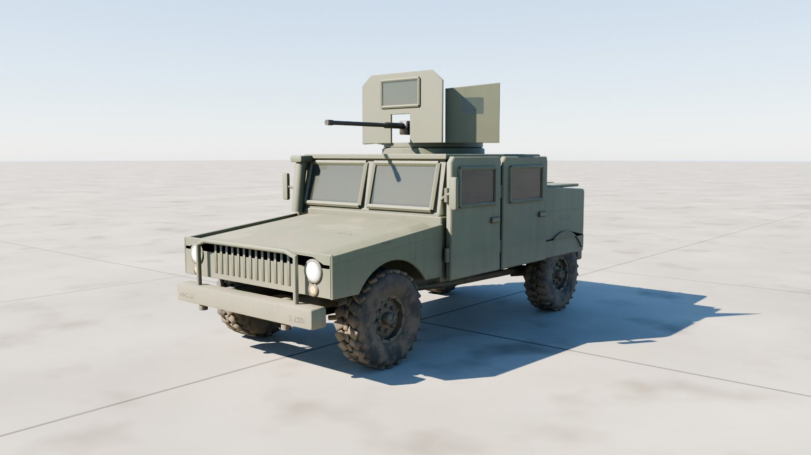
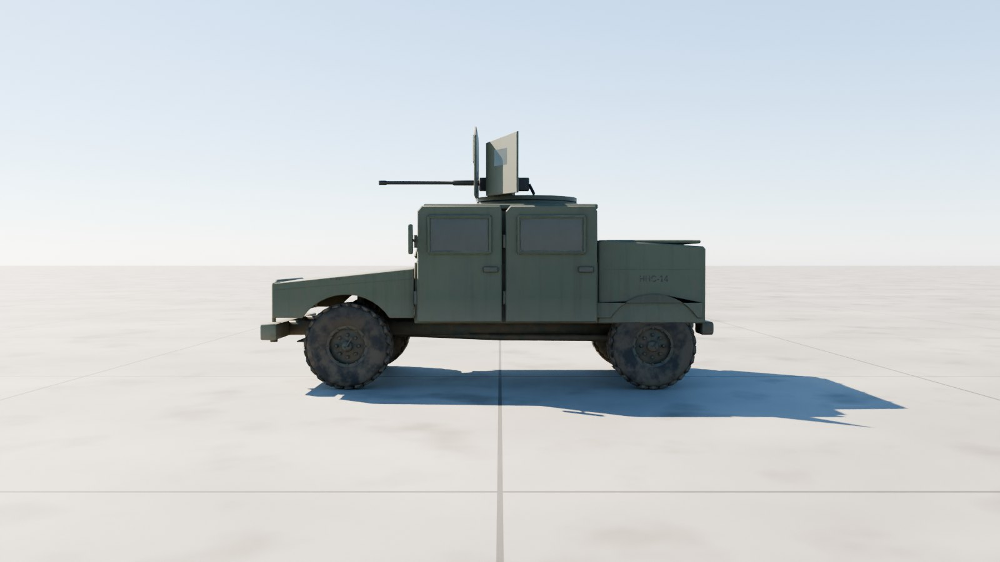
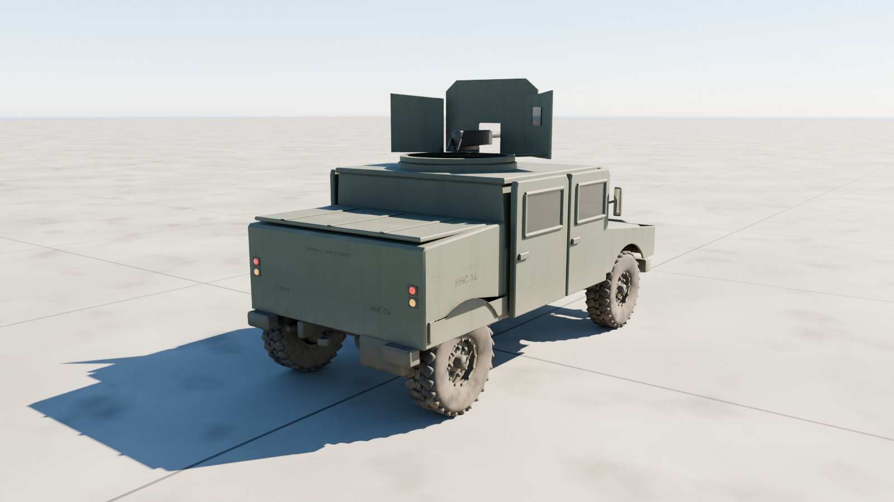
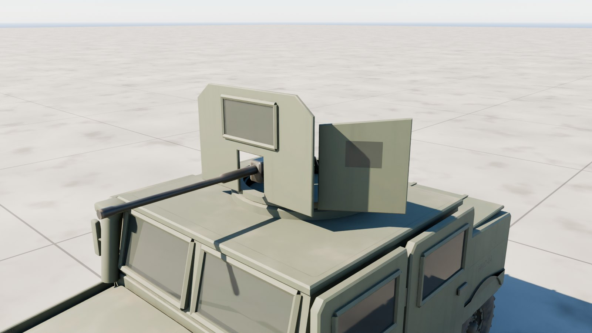
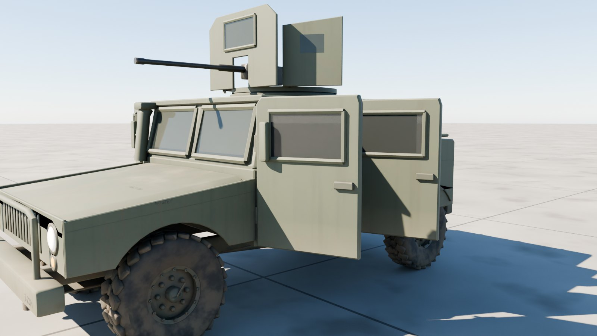

# M1151A1 HMMWV

The US Army's up-armoured M1151A1 HMMWV at 1:1 scale, outside only: the wide hood and slotted grille, the armoured cab with four heavy doors and thick windows, the rear cargo shell, the gunner's turret with O-GPK shields round an M2, and four wheels on 37 x 12.50 R16.5 tyres and beadlock rims.



| Side | Rear |
| --- | --- |
|  |  |
| **Gunner's turret** | **Doors open** |
|  |  |

## Files

| File | What it is |
| --- | --- |
| `m1151_hmmwv.glb` | **The Humvee.** Textured, with the turret, gun, doors, cargo lid and every wheel and the steering its own node. 7.4 MB. |
| `m1151_hmmwv_web.glb` | A lighter copy with half-size WebP textures, for browsers and phones. 2.8 MB. |
| `m1151_hmmwv_viewer.html` | Opens the Humvee in your browser with a double-click: orbit round it, drive and steer it, traverse the turret, elevate the M2, open the doors and the cargo lid. 4.3 MB; not checked in, `node modelkit/finish.mjs` makes it. |
| `measurements.json` | The finished model measured against the published dimensions. |
| `build.py`, `parts.py`, `markings.py`, `hmmwv.py` | The Blender build (it uses the shared `../modelkit`). |

## Scale: 1:1

Built to AM General's published M1151A1 figures; `build.py` measures the finished geometry against them on every build:

| Dimension | Published (m) | Model (m) |
| --- | ---: | ---: |
| Length | 4.928 | 4.926 |
| Width (over the mirrors) | 2.565 | 2.565 |
| Height (to the cab roof) | 2.007 | 2.007 |
| Wheelbase | 3.302 | 3.302 |
| Track | 1.819 | 1.819 |
| Tyre diameter (37 in) | 0.940 | 0.943 |

All within 3 mm.

- **Units and axes:** metres, glTF axes. +Y is up, +Z points to the front, and +X is the left.
- **Origin:** on the ground, on the centreline, midway between the axles.

## Moving parts

Each is its own node, pivoted where the real part turns. Its glTF extras say how it moves: `control` (wheel, steer, track, hinge, traverse, elevate, cargo), `axis`, `limits`, and `drive` in words.

| Node | Moves |
| --- | --- |
| `Turret` | the gunner's turret: traverses about local Y; + turns it left, all the way round |
| `Gun` | the M2 on its pintle: elevates about (−1, 0, 0); + raises it, −15° to +50° |
| `Door_{Front,Rear}_{Left,Right}` | swing about `axis` on their front hinges; + opens them outward (group `Doors`) |
| `Cargo_Lid` | the cargo shell's deck lid lifts about local X (group `Cargo lid`) |
| `Wheel_{1,2}_{Left,Right}` | spin about local X; + rolls forward (radius in the extras) |
| `Steer_1_{Left,Right}` | steer about local Y; + turns left. The front wheels sit inside these nodes. |
| `Light_*` | head, blackout and tail lights; their lens materials `Light_White`, `Light_Amber` and `Light_Red` are emissive, so scale the emission to switch them |

## Look

- **Paint:** CARC green 383 with the hood's seams and latches. Rebuild with `--scheme tan` for desert tan.
- **Markings:** bumper codes (1-23IN, HHC-14) and stencils.
- **Weathering:** mud thrown up by the wheels, dust on the hood and roof, worn edges.
- **Glass:** armoured windows tinted dark, the cab's interior dark behind them.

| Texture set | Size | Covers |
| --- | --- | --- |
| `M1151_Paint` | 4096² | Body, doors, turret shields, bumper, lights |
| `M1151_Chassis` | 2048² | Wheels and tyres, frame and axles, the M2 |

Each set has a base colour, an occlusion-roughness-metallic map and a normal map (MikkTSpace tangents included). Glass, optics and light lenses use plain material values.

## Performance

| File | Triangles | Draw calls | Nodes | Textures | Texture memory on the GPU |
| --- | ---: | ---: | ---: | --- | ---: |
| `m1151_hmmwv.glb` | 45,022 | 56 | 64 | 3 at 4096², 3 at 2048² | about 320 MB |
| `m1151_hmmwv_web.glb` | 45,022 | 56 | 64 | 6 at 1024² | about 32 MB |

Texture memory assumes uncompressed RGBA with mipmaps; GPU texture compression (KTX2/Basis, BCn or ASTC) cuts it by four to eight times.

## Rebuilding

```sh
pip install bpy==5.0.1 pillow                     # once, with Python 3.11
(cd apache-cockpit && npm install)                # once: glTF-Transform, sharp, esbuild, three
python3.11 m1151-hmmwv/build.py --glb out/m1151_hmmwv.glb --textures 4096   # build, paint, bake, export
node modelkit/finish.mjs out/m1151_hmmwv.glb m1151-hmmwv m1151_hmmwv            # game and web files, the viewer
python3.11 modelkit/beauty.py m1151-hmmwv m1151-hmmwv/m1151_hmmwv.glb out/docs     # the renders
python3.11 m1151-hmmwv/build.py --preview out --lookdev    # a quick look at the paint, without baking
```

## Accuracy

- **Published dimensions:** length, width over the mirrors, height to the cab roof, wheelbase, track and the tyres all match.
- **Estimated:** the body's sections, the doors and windows, the turret's shields and the underbody.
- **Markings:** plausible but made up.
