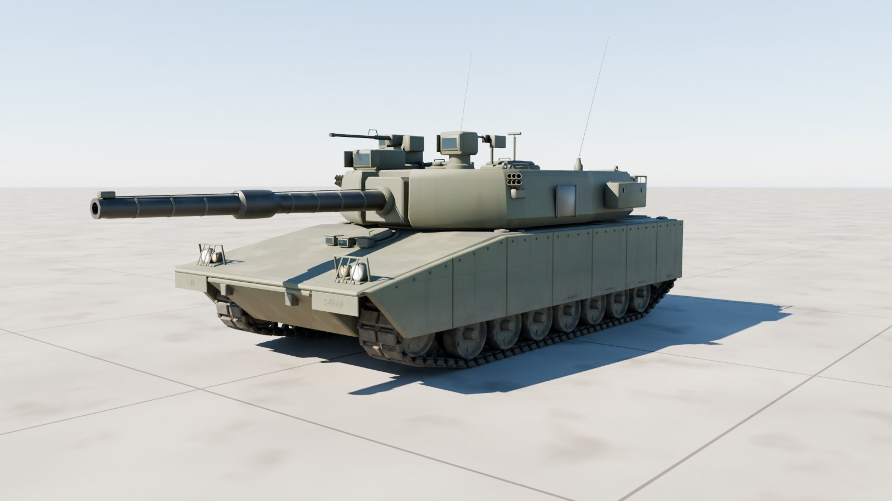
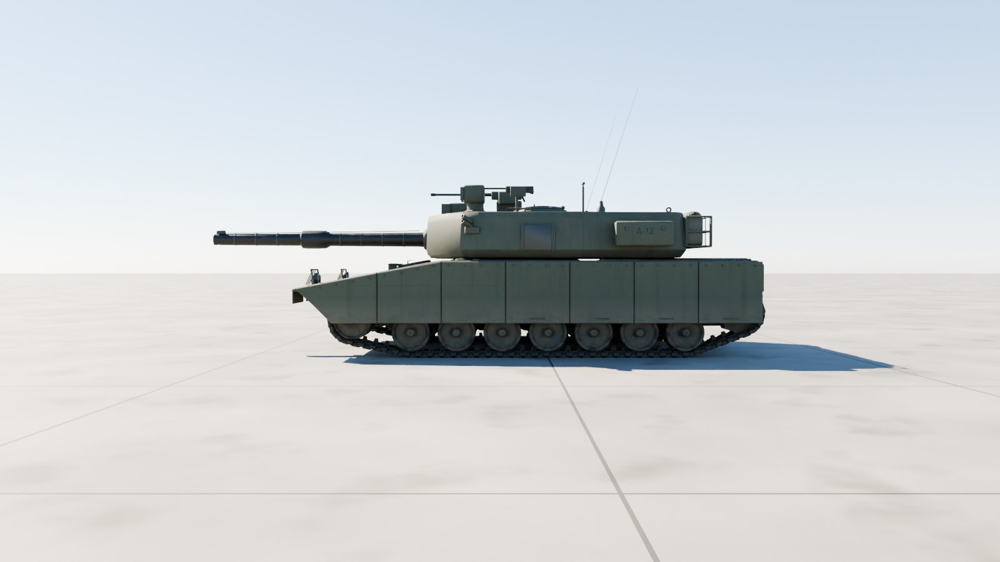
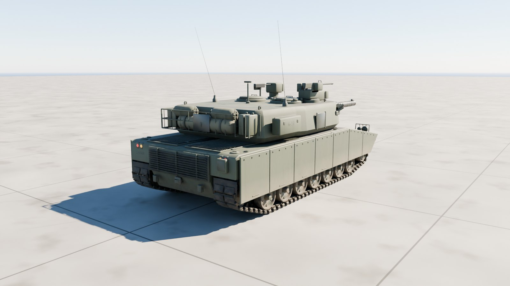
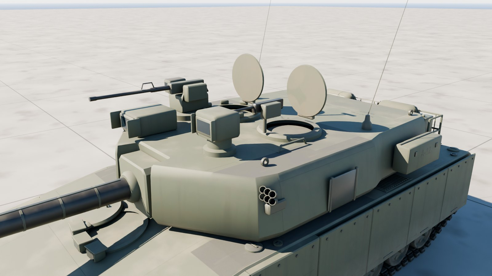
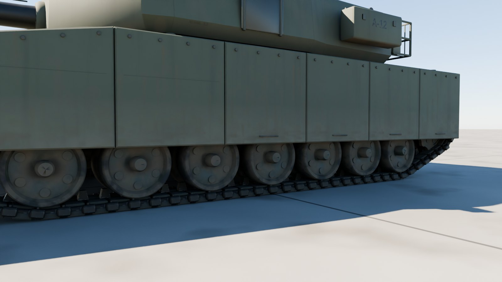

# M1A2 SEPv3 Abrams

The US Army's M1A2 SEPv3 main battle tank at 1:1 scale, outside only: the 120 mm M256 gun, CROWS-LP with its M2 on the commander's side, the loader's M240, armoured side skirts, the T158 track on seven road wheels a side, and a crew's kit in the bustle rack.



| Side | Rear |
| --- | --- |
|  |  |
| **Turret** | **Running gear** |
|  |  |

## Files

| File | What it is |
| --- | --- |
| `m1a2_sepv3.glb` | **The tank.** Textured, with the turret, gun, hatches, every wheel and each track link its own node. 21.6 MB. |
| `m1a2_sepv3_web.glb` | A lighter copy with half-size WebP textures, for browsers and phones. 6.2 MB. |
| `m1a2_sepv3_viewer.html` | Opens the tank in your browser with a double-click: orbit round it, drive it with the tracks running, traverse the turret, elevate the gun, open the hatches and switch to night. 8.9 MB; not checked in, `node modelkit/finish.mjs` makes it. |
| `measurements.json` | The finished model measured against the published dimensions. |
| `build.py`, `hull.py`, `turret.py`, `markings.py`, `abrams.py` | The Blender build (it uses the shared `../modelkit`). |

## Scale: 1:1

Built to the published M1A2 SEPv3 figures; `build.py` measures the finished geometry against them on every build:

| Dimension | Published (m) | Model (m) |
| --- | ---: | ---: |
| Length, gun forward | 9.770 | 9.770 |
| Hull length | 7.930 | 7.930 |
| Width (over the skirts) | 3.660 | 3.660 |
| Height (to the turret roof) | 2.440 | 2.440 |
| Ground clearance | 0.480 | 0.480 |
| Track width (T158) | 0.635 | 0.635 |
| Road wheel diameter | 0.635 | 0.635 |
| Track on the ground (road wheel 1 to 7) | 4.572 | 4.572 |

All within 1 mm.

- **Units and axes:** metres, glTF axes. +Y is up, +Z points to the front, and +X is the left.
- **Origin:** on the ground, on the centreline, midway between the first and last road wheels.

## Moving parts

Each is its own node, pivoted where the real part turns. Its glTF extras say how it moves: `control` (wheel, steer, track, hinge, traverse, elevate, cargo), `axis`, `limits`, and `drive` in words.

The gun also carries `limits_by_traverse`: its lowest and highest elevation every `traverse_step` (5) degrees of the turret's traverse, measured against the hull, so a game can lift it over the deck and whatever else stands in its way instead of letting it sink through. The viewer clamps to it.

| Node | Moves |
| --- | --- |
| `Turret` | traverses about local Y; + turns it left, all the way round |
| `Gun` | the 120 mm M256: elevates about its `axis`, (−1, 0, 0); + raises it, −9° to +20°; over the engine deck its `limits_by_traverse` lift it to −3.8° |
| `Driver_Hatch`, `Commander_Hatch`, `Loader_Hatch` | open about their hinges (group `Hatches`): the driver's swings round to the right on the post at its front right corner, in the glacis' plane; the commander's and loader's hinge at their backs and stand up clear of the vision blocks |
| `CROWS`, `CITV` | the remote weapon station and the commander's viewer slew about local Y on their own (`control: aux`) |
| `Road_Wheel_{Left,Right}_{1-7}`, `Idler_*`, `Sprocket_*`, `Return_Roller_*` | spin about local X; each node's `radius` turns distance driven into rotation |
| `Track_Left`, `Track_Right` | the T158 track: one link mesh, 79 link nodes a side |
| `Light_*` | head, blackout and tail lights; their lens materials `Light_White`, `Light_Amber` and `Light_Red` are emissive, so scale the emission to switch them |

**Tracks.** Each `Track_*` node's extras carry the loop its links ride round (`path`: z and y pairs in the node's own frame, clockwise seen from the left), the link `pitch` and the number of `links`. Link *i* sits on the chord between the pins at *i*·pitch + travel and (*i* + 1)·pitch + travel, where travel is how far the vehicle has driven forward. That is all a game needs to run the tracks; the shared viewer does exactly this.

## Look

- **Paint:** CARC green 383 with the armour's seams and bolt rows, the turret's blow-out panels, and non-skid on the deck and roof. Rebuild with `--scheme tan` for desert tan.
- **Markings:** bumper codes (1-66AR, A-12), the number on the turret and the gun tube's name, AMBUSH.
- **Weathering:** mud thrown over the skirts and running gear, dust settled on top, exhaust soot over the rear grille, grime in the corners and worn edges.
- **Kit:** a rolled camouflage net, duffel bags and water cans in the bustle rack; combat ID panels on the turret.

| Texture set | Size | Covers |
| --- | --- | --- |
| `M1A2_Paint_Hull` | 4096² | Hull, glacis, deck, skirts, lights |
| `M1A2_Paint_Turret` | 4096² | Turret, gun shield and tube, sights, hatches, CROWS |
| `M1A2_Running_Gear` | 4096² | Road wheels, idlers, sprockets, rollers, suspension arms, the track link |
| `M1A2_Kit` | 2048² | Machine guns, stowage, combat ID panels |

Each set has a base colour, an occlusion-roughness-metallic map and a normal map (MikkTSpace tangents included). Glass, optics and light lenses use plain material values.

## Performance

| File | Triangles | Draw calls | Nodes | Textures | Texture memory on the GPU |
| --- | ---: | ---: | ---: | --- | ---: |
| `m1a2_sepv3.glb` | 200,728 | 422 | 264 | 9 at 4096², 3 at 2048² | about 832 MB |
| `m1a2_sepv3_web.glb` | 200,728 | 422 | 264 | 12 at 1024² | about 64 MB |

Texture memory assumes uncompressed RGBA with mipmaps; GPU texture compression (KTX2/Basis, BCn or ASTC) cuts it by four to eight times.

The track links are 158 nodes sharing one mesh; an engine that instances can draw them in one call.

## Rebuilding

```sh
pip install bpy==5.0.1 pillow                     # once, with Python 3.11
(cd apache-cockpit && npm install)                # once: glTF-Transform, sharp, esbuild, three
python3.11 m1a2-abrams/build.py --glb out/m1a2_sepv3.glb --textures 4096   # build, paint, bake, export
node modelkit/finish.mjs out/m1a2_sepv3.glb m1a2-abrams m1a2_sepv3            # game and web files, the viewer
python3.11 modelkit/beauty.py m1a2-abrams m1a2-abrams/m1a2_sepv3.glb out/docs     # the renders
python3.11 m1a2-abrams/build.py --preview out --lookdev    # a quick look at the paint, without baking
```

## Accuracy

- **Published dimensions:** length with the gun forward, hull length, width over the skirts, height to the turret roof, ground clearance, track width, road wheel diameter and the 180 in of track on the ground all match.
- **Estimated:** the track's centres, the idler and sprocket positions, the turret's exact plan and the roof fittings' layout.
- **Markings:** plausible but made up; the unit and number aren't a real tank's.
