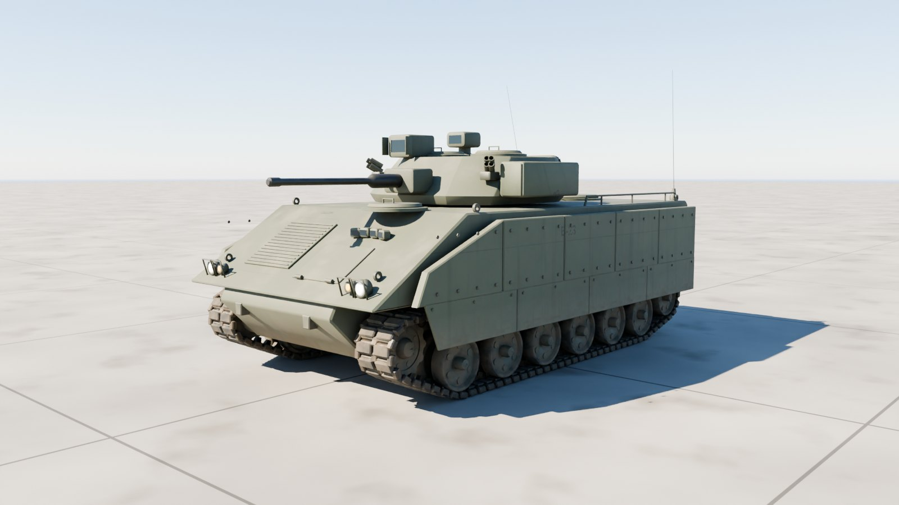
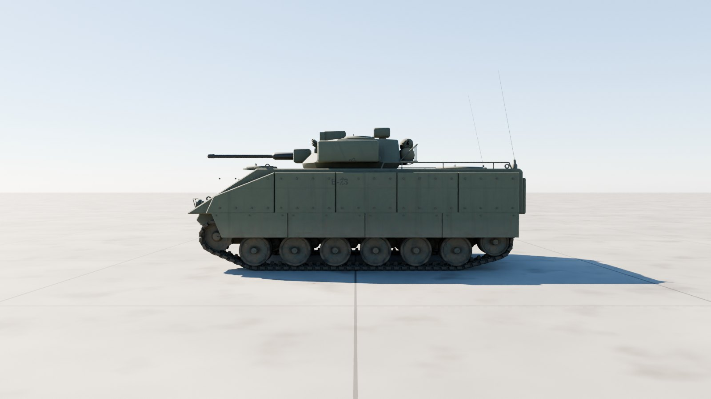
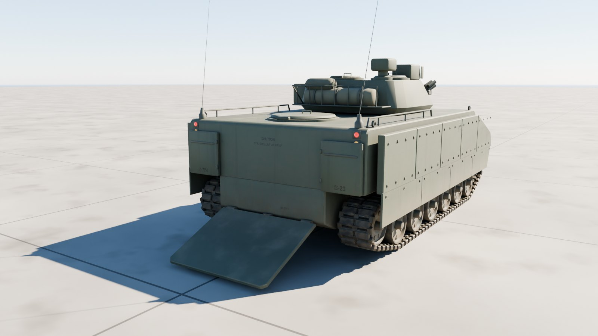
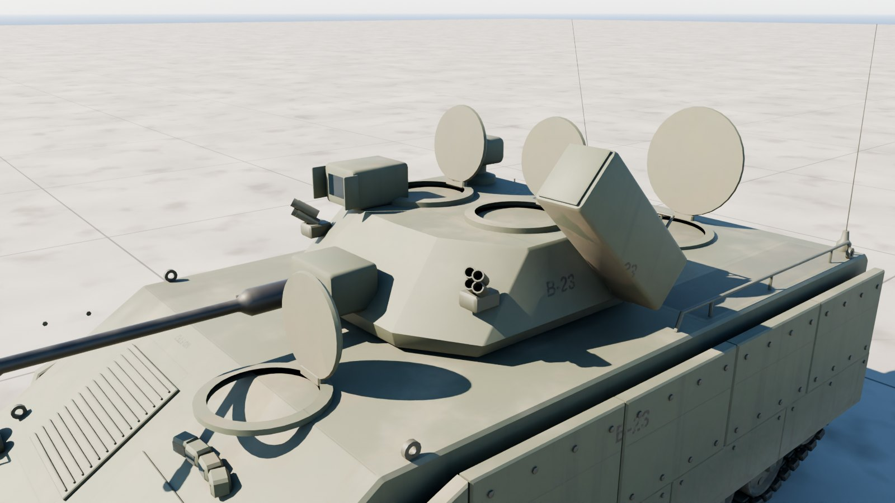
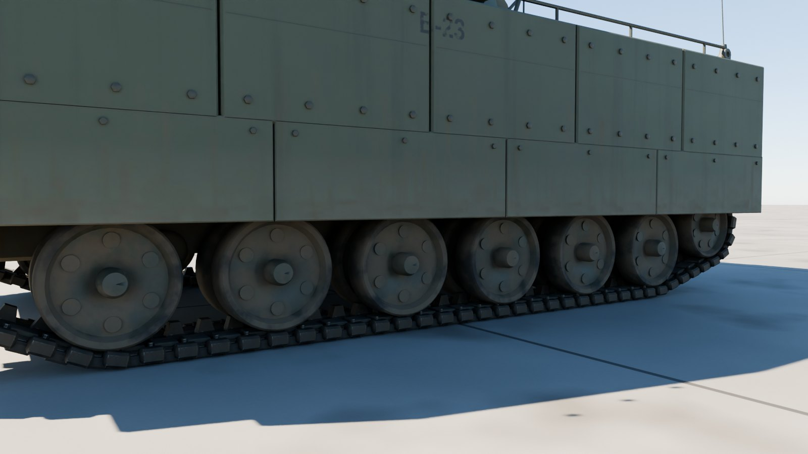

# M2A3 Bradley

The US Army's M2A3 Bradley infantry fighting vehicle at 1:1 scale, outside only: the two-man turret with its 25 mm M242 Bushmaster, coaxial M240C and twin TOW launcher, IBAS and the commander's independent viewer, add-on armour and skirts, the rear ramp for seven infantry, and the T157 track on six road wheels a side.



| Side | Rear, ramp down |
| --- | --- |
|  |  |
| **Turret** | **Running gear** |
|  |  |

## Files

| File | What it is |
| --- | --- |
| `m2a3_bradley.glb` | **The Bradley.** Textured, with the turret, gun, TOW launcher, ramp, hatches, every wheel and each track link its own node. 18.1 MB. |
| `m2a3_bradley_web.glb` | A lighter copy with half-size WebP textures, for browsers and phones. 4.8 MB. |
| `m2a3_bradley_viewer.html` | Opens the Bradley in your browser with a double-click: orbit round it, drive it with the tracks running, traverse the turret, elevate the gun, raise the TOW launcher, lower the ramp and open the hatches. 7.0 MB; not checked in, `node modelkit/finish.mjs` makes it. |
| `measurements.json` | The finished model measured against the published dimensions. |
| `build.py`, `parts.py`, `markings.py`, `bradley.py` | The Blender build (it uses the shared `../modelkit`). |

## Scale: 1:1

Built to the published M2A3 figures; `build.py` measures the finished geometry against them on every build:

| Dimension | Published (m) | Model (m) |
| --- | ---: | ---: |
| Length | 6.550 | 6.550 |
| Width (over the add-on armour) | 3.600 | 3.599 |
| Height (to the top of the CIV) | 2.980 | 2.980 |
| Ground clearance | 0.460 | 0.460 |
| Track width (T157) | 0.533 | 0.533 |
| Track on the ground (wheel 1 to 6) | 3.910 | 3.910 |

All within 1 mm.

- **Units and axes:** metres, glTF axes. +Y is up, +Z points to the front, and +X is the left.
- **Origin:** on the ground, on the centreline, midway between the first and last road wheels.

## Moving parts

Each is its own node, pivoted where the real part turns. Its glTF extras say how it moves: `control` (wheel, steer, track, hinge, traverse, elevate, cargo), `axis`, `limits`, and `drive` in words.

The gun also carries `limits_by_traverse`: its lowest and highest elevation every `traverse_step` (5) degrees of the turret's traverse, measured against the hull, so a game can lift it over the deck and whatever else stands in its way instead of letting it sink through. The viewer clamps to it.

| Node | Moves |
| --- | --- |
| `Turret` | traverses about local Y; + turns it left, all the way round |
| `Gun` | the 25 mm M242 and coaxial M240C: elevate about (−1, 0, 0); + raises them, −10° to +60°; over the hull roof and the squad's hatch its `limits_by_traverse` lift it to −6° |
| `TOW_Launcher` | raises about local X at its back to the firing position (group `TOW launcher`) |
| `Ramp` | lowers about local X at its foot, down to the ground (group `Ramp`); `Ramp_Door` opens in it (group `Ramp door`) |
| `Driver_Hatch`, `Commander_Hatch`, `Gunner_Hatch`, `Troop_Hatch` | open about their hinges (group `Hatches`); the commander's stands open in front of the CIV |
| `CIV` | the commander's independent viewer slews about local Y on its own (`control: aux`) |
| `Road_Wheel_{Left,Right}_{1-6}`, `Idler_*`, `Sprocket_*`, `Return_Roller_*` | spin about local X; each node's `radius` turns distance driven into rotation |
| `Track_Left`, `Track_Right` | the T157 track: one link mesh shared by every link node |
| `Light_*` | head, blackout and tail lights; their lens materials `Light_White`, `Light_Amber` and `Light_Red` are emissive, so scale the emission to switch them |

**Tracks.** Each `Track_*` node's extras carry the loop its links ride round (`path`: z and y pairs in the node's own frame, clockwise seen from the left), the link `pitch` and the number of `links`. Link *i* sits on the chord between the pins at *i*·pitch + travel and (*i* + 1)·pitch + travel, where travel is how far the vehicle has driven forward. That is all a game needs to run the tracks; the shared viewer does exactly this.

## Look

- **Paint:** CARC green 383 with the add-on armour's seams and bolt rows and non-skid on the roof. Rebuild with `--scheme tan` for desert tan.
- **Markings:** bumper codes (2-7IN, B-23), the vehicle number on the hull and the TOW launcher, the ramp's warnings.
- **Weathering:** mud over the skirts and running gear, dust settled on top, exhaust soot streaming back from the outlet on the right, worn edges.
- **Kit:** a rolled camouflage net and a duffel bag in the turret's bustle rack.

| Texture set | Size | Covers |
| --- | --- | --- |
| `M2A3_Paint_Hull` | 4096² | Hull, armour, ramp, hatches, lights |
| `M2A3_Paint_Turret` | 4096² | Turret, gun, TOW launcher, sights |
| `M2A3_Running_Gear` | 4096² | Road wheels, idler, sprocket, rollers, suspension arms, the track link |
| `M2A3_Kit` | 1024² | Gun metal, stowage |

Each set has a base colour, an occlusion-roughness-metallic map and a normal map (MikkTSpace tangents included). Glass, optics and light lenses use plain material values.

## Performance

| File | Triangles | Draw calls | Nodes | Textures | Texture memory on the GPU |
| --- | ---: | ---: | ---: | --- | ---: |
| `m2a3_bradley.glb` | 185,048 | 433 | 272 | 9 at 4096², 3 at 1024² | about 784 MB |
| `m2a3_bradley_web.glb` | 185,048 | 433 | 272 | 12 at 1024² | about 64 MB |

Texture memory assumes uncompressed RGBA with mipmaps; GPU texture compression (KTX2/Basis, BCn or ASTC) cuts it by four to eight times.

## Rebuilding

```sh
pip install bpy==5.0.1 pillow                     # once, with Python 3.11
(cd apache-cockpit && npm install)                # once: glTF-Transform, sharp, esbuild, three
python3.11 m2a3-bradley/build.py --glb out/m2a3_bradley.glb --textures 4096   # build, paint, bake, export
node modelkit/finish.mjs out/m2a3_bradley.glb m2a3-bradley m2a3_bradley            # game and web files, the viewer
python3.11 modelkit/beauty.py m2a3-bradley m2a3-bradley/m2a3_bradley.glb out/docs     # the renders
python3.11 m2a3-bradley/build.py --preview out --lookdev    # a quick look at the paint, without baking
```

## Accuracy

- **Published dimensions:** length, width over the add-on armour, height to the top of the CIV, ground clearance, track width and the track's ground contact all match.
- **Estimated:** the track centres, the idler and sprocket positions, the turret's plan, and the armour panels' layout.
- **Markings:** plausible but made up.
