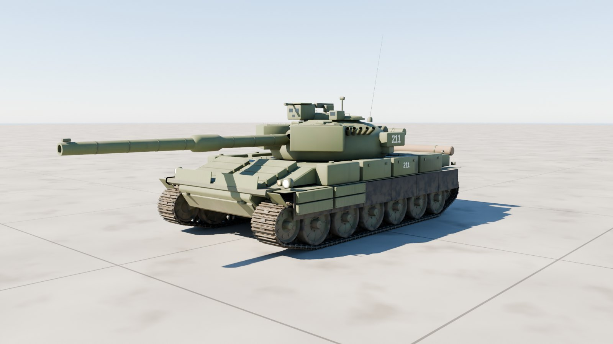
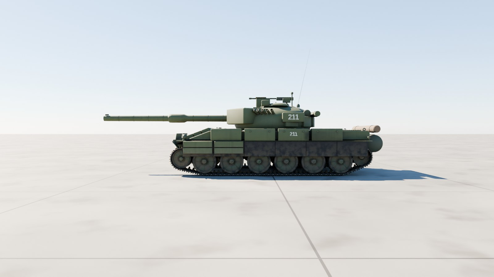
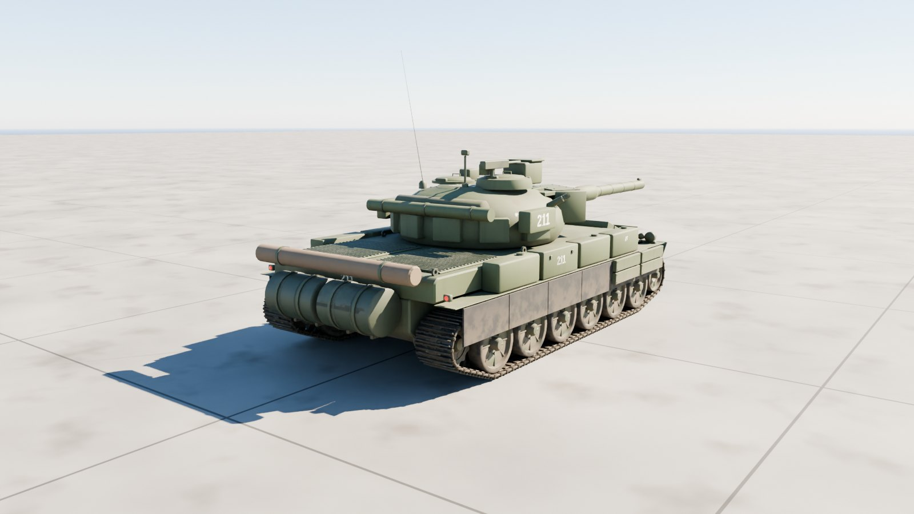
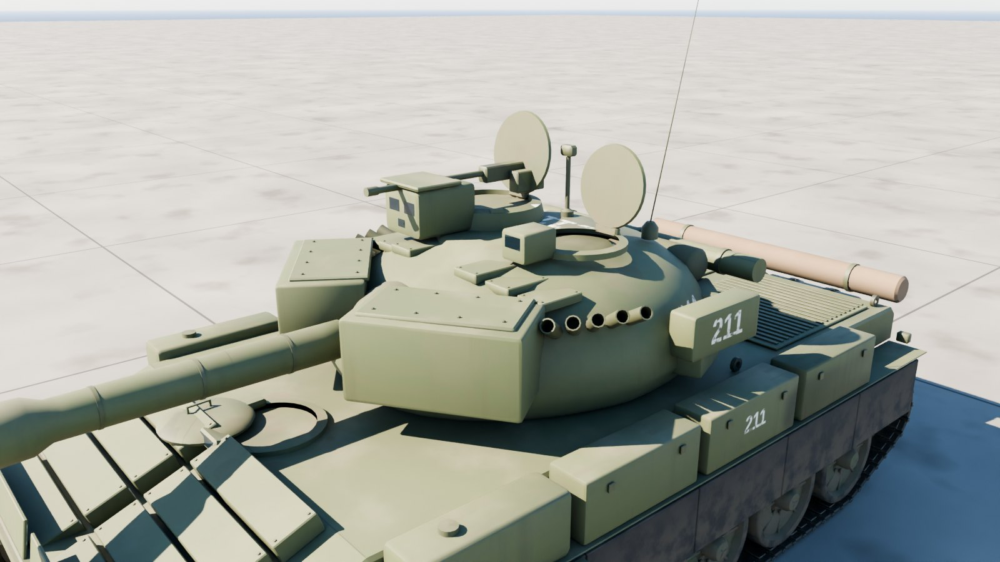
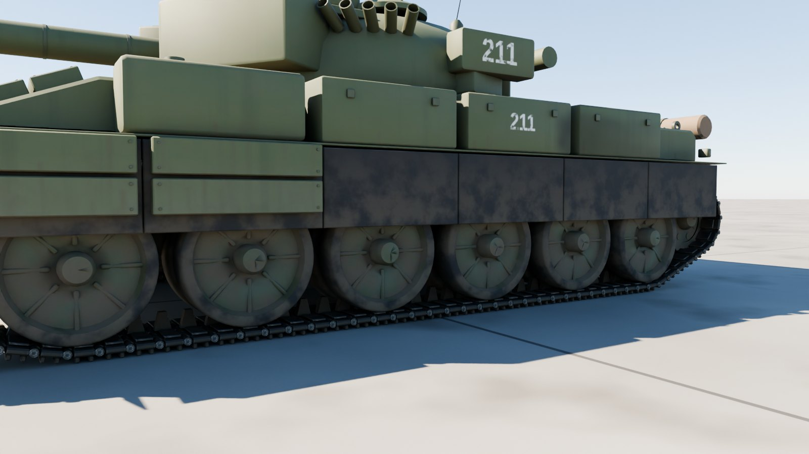

# T-72B3

The Russian T-72B3 main battle tank at 1:1 scale, outside only: the cast turret with its Kontakt-5 wedges and roof bricks, the 125 mm 2A46M-5 gun, the Sosna-U sight, the commander's cupola with a 12.7 mm Kord, 902B smoke dischargers, Kontakt-5 on the glacis, the dozer blade, rubber skirts, fuel drums and the unditching log, and the single-pin track on six road wheels a side.



| Side | Rear |
| --- | --- |
|  |  |
| **Turret** | **Running gear** |
|  |  |

## Files

| File | What it is |
| --- | --- |
| `t72b3.glb` | **The tank.** Textured, with the turret, gun, cupola, hatches, every wheel and each track link its own node. 20.4 MB. |
| `t72b3_web.glb` | A lighter copy with half-size WebP textures, for browsers and phones. 5.9 MB. |
| `t72b3_viewer.html` | Opens the tank in your browser with a double-click: orbit round it, drive it with the tracks running, traverse the turret, elevate the gun and open the hatches. 8.4 MB; not checked in, `node modelkit/finish.mjs` makes it. |
| `measurements.json` | The finished model measured against the published dimensions. |
| `build.py`, `parts.py`, `markings.py`, `t72.py` | The Blender build (it uses the shared `../modelkit`). |

## Scale: 1:1

Built to the published T-72B3 figures; `build.py` measures the finished geometry against them on every build:

| Dimension | Published (m) | Model (m) |
| --- | ---: | ---: |
| Length, gun forward | 9.530 | 9.530 |
| Hull length | 6.860 | 6.872 |
| Width (over the skirts) | 3.600 | 3.600 |
| Height (to the turret roof) | 2.260 | 2.260 |
| Track width (RMSh) | 0.580 | 0.580 |
| Track on the ground (wheel 1 to 6) | 4.270 | 4.270 |
| Tread (track centres) | 2.790 | 2.790 |
| Road wheel diameter | 0.750 | 0.750 |

All within 12 mm.

- **Units and axes:** metres, glTF axes. +Y is up, +Z points to the front, and +X is the left.
- **Origin:** on the ground, on the centreline, midway between the first and last road wheels.

## Moving parts

Each is its own node, pivoted where the real part turns. Its glTF extras say how it moves: `control` (wheel, steer, track, hinge, traverse, elevate, cargo), `axis`, `limits`, and `drive` in words.

| Node | Moves |
| --- | --- |
| `Turret` | traverses about local Y; + turns it left, all the way round |
| `Gun` | the 125 mm 2A46M-5 and its coaxial PKT: elevate about (−1, 0, 0); + raises them, −6° to +14° |
| `Commander_Cupola` | slews about local Y with its periscopes and the Kord (`control: aux`) |
| `Driver_Hatch`, `Commander_Hatch`, `Gunner_Hatch` | open about their hinges (group `Hatches`) |
| `Road_Wheel_{Left,Right}_{1-6}`, `Idler_*`, `Sprocket_*`, `Return_Roller_*` | spin about local X; each node's `radius` turns distance driven into rotation |
| `Track_Left`, `Track_Right` | the RMSh single-pin track, its top run sagging between the rollers |
| `Light_*` | head, blackout and tail lights; their lens materials `Light_White`, `Light_Amber` and `Light_Red` are emissive, so scale the emission to switch them |

**Tracks.** Each `Track_*` node's extras carry the loop its links ride round (`path`: z and y pairs in the node's own frame, clockwise seen from the left), the link `pitch` and the number of `links`. Link *i* sits on the chord between the pins at *i*·pitch + travel and (*i* + 1)·pitch + travel, where travel is how far the vehicle has driven forward. That is all a game needs to run the tracks; the shared viewer does exactly this.

## Look

- **Paint:** Russian protective green with weld seams.
- **Markings:** the tactical number 211 in white on the turret, fenders and rear.
- **Weathering:** heavy mud over the skirts, fenders and running gear, dust settled on top, exhaust soot along the left side from the exhaust louvre.
- **Kit:** two 200 l fuel drums and the unditching log at the back, the snorkel and a tarpaulin on the turret's rear.

| Texture set | Size | Covers |
| --- | --- | --- |
| `T72_Paint_Hull` | 4096² | Hull, Kontakt-5, fenders and boxes, lights |
| `T72_Paint_Turret` | 4096² | Turret, Kontakt-5, gun, sights, cupola |
| `T72_Running_Gear` | 4096² | Road wheels, idler, sprocket, rollers, suspension arms, the track link |
| `T72_Kit` | 1024² | Tarpaulin, drums, log |

Each set has a base colour, an occlusion-roughness-metallic map and a normal map (MikkTSpace tangents included). Glass, optics and light lenses use plain material values.

## Performance

| File | Triangles | Draw calls | Nodes | Textures | Texture memory on the GPU |
| --- | ---: | ---: | ---: | --- | ---: |
| `t72b3.glb` | 236,650 | 283 | 286 | 9 at 4096², 3 at 1024² | about 784 MB |
| `t72b3_web.glb` | 236,650 | 283 | 286 | 11 at 1024² | about 59 MB |

Texture memory assumes uncompressed RGBA with mipmaps; GPU texture compression (KTX2/Basis, BCn or ASTC) cuts it by four to eight times.

## Rebuilding

```sh
pip install bpy==5.0.1 pillow                     # once, with Python 3.11
(cd apache-cockpit && npm install)                # once: glTF-Transform, sharp, esbuild, three
python3.11 t72b3/build.py --glb out/t72b3.glb --textures 4096   # build, paint, bake, export
node modelkit/finish.mjs out/t72b3.glb t72b3 t72b3            # game and web files, the viewer
python3.11 modelkit/beauty.py t72b3 t72b3/t72b3.glb out/docs     # the renders
python3.11 t72b3/build.py --preview out --lookdev    # a quick look at the paint, without baking
```

## Accuracy

- **Published dimensions:** length with the gun forward, hull length (over the fuel drums), width over the skirts, height to the turret roof, track width, track on the ground, tread and road wheel diameter all match.
- **Estimated:** the idler and sprocket positions, the turret's cast shape, the link pitch and the fittings' layout.
- **Markings:** a plausible tactical number, not a real tank's.
